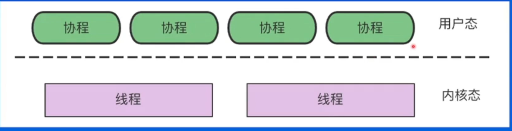
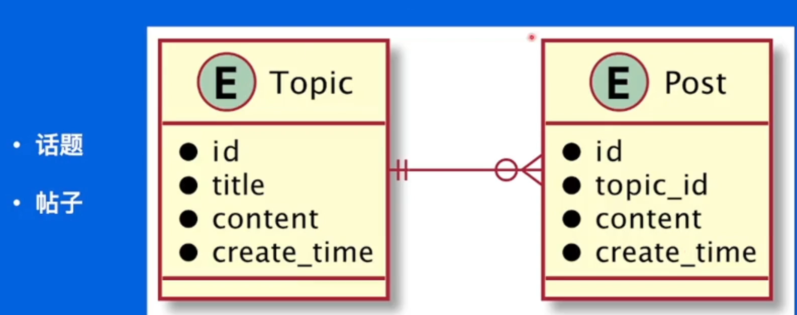
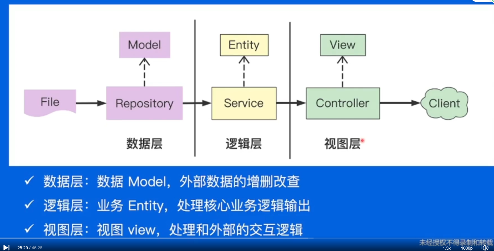

# 1.Go语言进阶

并发、并行

## 1.1 Goroutine

协程:用户态，轻量级线程，栈MB级别。
线程:内核态，线程跑多个协程，栈KB级别。

## 1.2 CSP

提倡通过通信共享内存而不是通过共享内存而实现通信

## 1.3 Channel

## 1.4 并发安全Lock

# 2.依赖管理

# 4.项目实践

## 需求描述

√展示话题(标题，文字描述)和回帖列表
√暂不考虑前端页面实现，仅仅实现一个本地web服务
√话题和回帖数据用文件存储

 

## 分层结构

