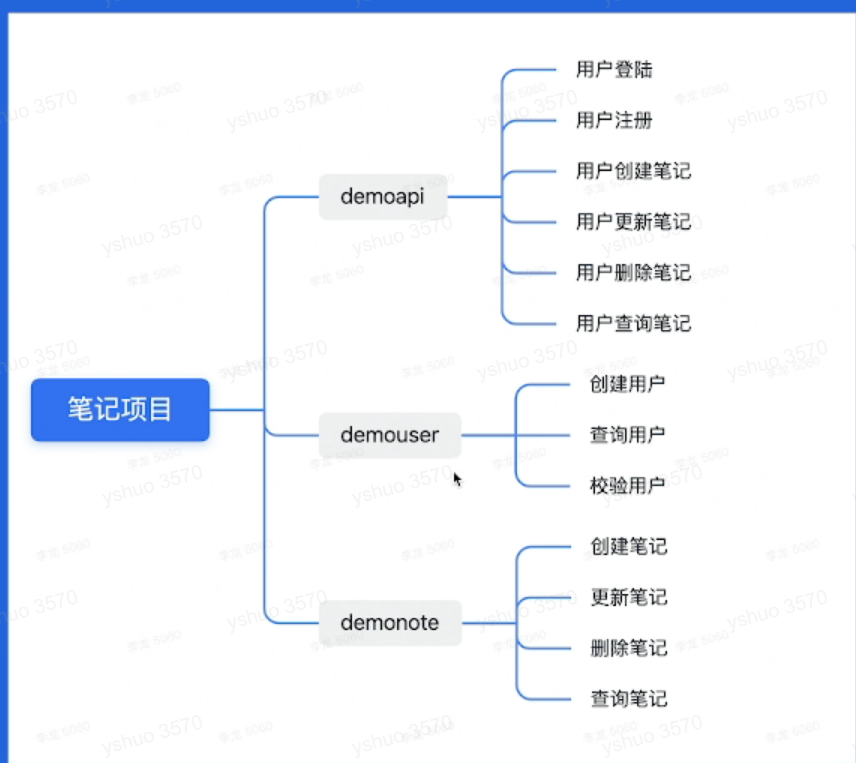
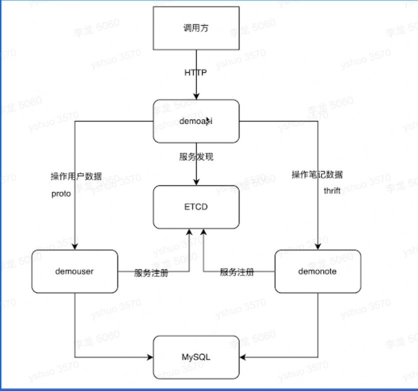
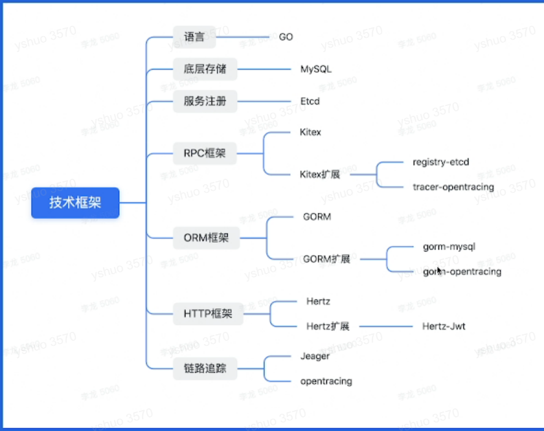

1/17直播

gorm穿的都是指针，这样就可以对元数据进行更改

gorm中执行语句是链式调用，获取结果要用result接受操作语句的结果，然后再用result.xx接受结果

gorm中动词比如create等等代表最后的操作，后面不能再加条件了

进行执行操作时要先定义一个结构体再传值（指针类型），通过操作把数据库值传入结构体

id：111那个，为什么能实现全部的更新：有where条件可以无视，没有的话就是兜底，用来当条件

为什么前面的要加&，下面的不需要了

gorm事务推荐使用transaction

gorm hook

kitex

Hertz

func有两个上下文负责不同功能

反射

项目有两个，他有一个新的更新，看视频

