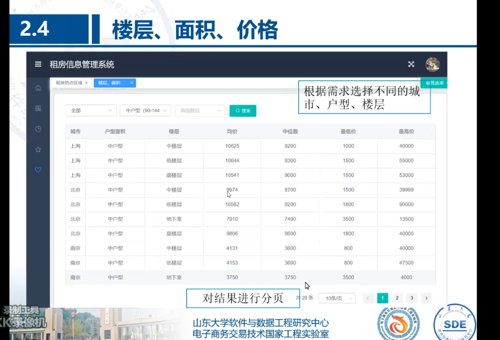

# 索引

组合索引({‘city’:1,‘district’:1}

base_info内嵌文档索引

price单索引

```java
db.insert_data.ensureIndex({ "city" :1,"district":1})
db.insert_data.ensureIndex({"base_info.types":1})
db.insert_data.ensureIndex(i"price":1})
   
   db.insert_data.find(i"base_info.types" : "6=1厅2卫"}).explain("executionStats")
db.insert_data.find({"city":"斑南" , "district" :"高新"}).explain("executionStats")
db.insert_data.find( {"city" :"北京" , " prsice" :{$lt:10000]}}) .explain("executionStats")

```


# 题目 

vue-element-admin

## 第一题


直方图，挑选一个type


## 第二题


折线图

## 

## 第三题


两个城市，分别展示


## 拓展

### 1


### 2

**


### 3




### 4

# neo4j

房屋house：area面积、maintain、

district区域

lease_mode

direction

region

elevator

water

electricity

washing_machine

air_condition

wardrobe

tv

refrigerator

heater

bed

broadband

gas

MATCH (p1:houser {_id: '628c6014b81ebb7a531422bf'})
MATCH (p2:houser {_id: '628c7c7505574caf26abed73'})
RETURN algo.linkprediction.adamicAdar(p1, p2, {relationshipQuery: 'is'}) AS score