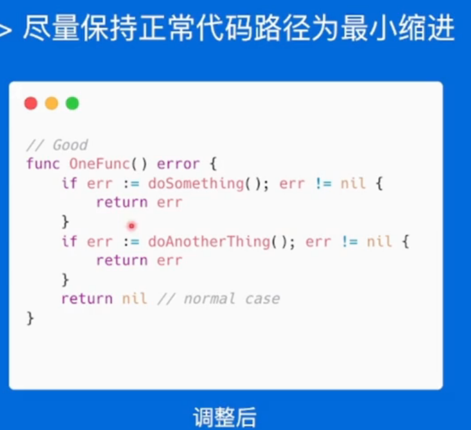
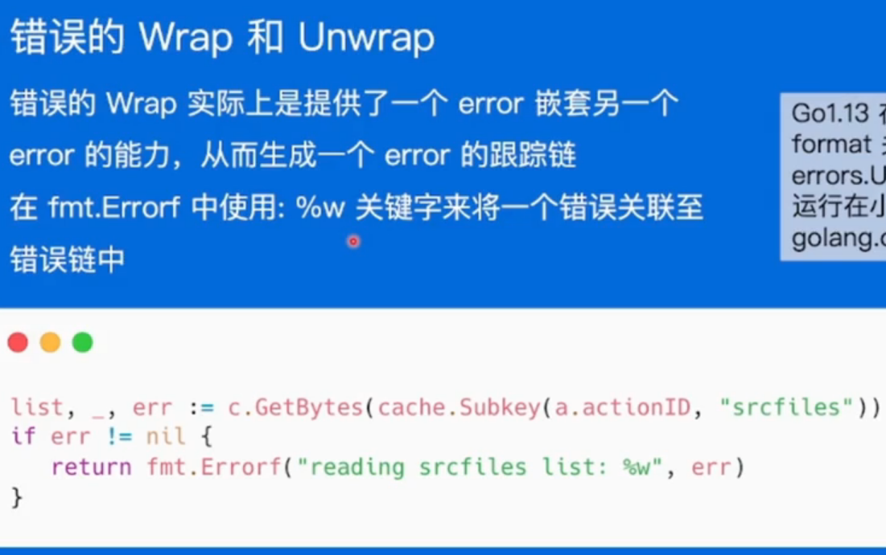
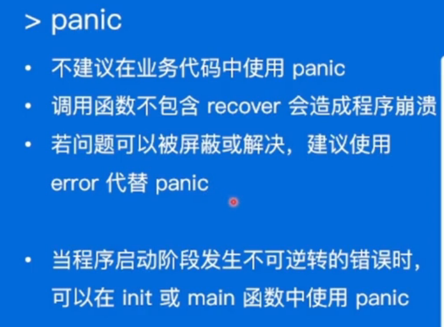
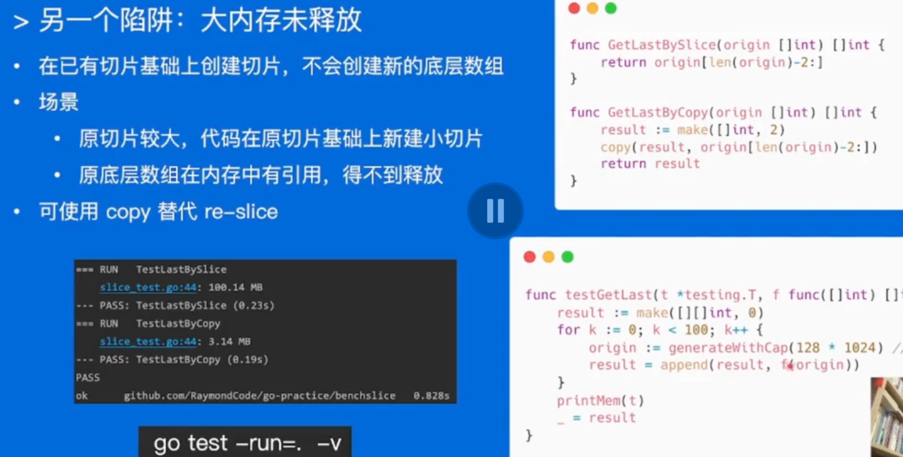

高质量编程简介及编码规范

# 高质量编程

## 高质量编程简介

编写的代码正确可靠，简洁清晰

**简单性：**
消除“多余的复杂性”，以简单清晰的逻辑编写代码。不理解的代码无法修复改进

**可读性：**

代码是写给人看的，而不是机器
·编写可维护代码的第一步是确保代码可读

**生产力：**
·团队整体工作效率非常重要

## 编码规范

1. 注释：

公共符号始终要注释（不需要注释实现接口的方法）

解释代码作用，如何做的，实现的原因，出错情况

2. 代码格式：

gofmt自动格式化代码

3. 命名规范

简洁胜于冗长

缩略词全大写，但当其位于变量开头且不需要导出时，使用全小写

​	·例如使用ServeHTTP而不是ServeHttp
​	·使用XMLHTTPRequest或者xmlHTTPRequest

变量距离其被使用的地方越远，则需要携带越多的上下文信息
	·全局变量在其名字中需要更多的上下文信息，使得在不同地方可以轻易辨认出其含义

对函数来说，不需要携带包的上下文信息，因为包名和函数名是成对出现的。

4. 控制流程

避免嵌套，比如if、else

优先处理错误情况/特殊情况，尽早返回或继续循环来减少嵌套

线性原理，处理逻辑尽量走直线，

避免复杂的嵌套分支正常流程代码沿着屏幕向下移动
提升代码可维护性和可读性
故障问题大多出现在复杂的条件语句和循环语句中

5. 错误和异常处理

简单错误用errors.new新建匿名函数，有格式化邀请用fmt.Errorf

## 性能优化建议

Benchmark 工具检测性能指标

slice，map预分配内存，make（）**创建切片时提供容量信息**，减少内存分配次数

字符串处理：stringBulider、

使用空结构体struct{}作为占位符

set使用map代替

atmic包代替加锁

