# 算法课

## 1.异或

#### 异或值

给两个变量的值换过来:

```JAVA
a = a^b
b = a^b
a = a^b
```

> 注意 a 和 b 可以是一样的数字等等等，但是不可以是同一个，比如说数组里面 a 和 b 不能代表同一个元素


#### 异或算一个不一样的

数组有一个数字出现了奇数次，其他的数都是偶数:

```JAVA
int xor = 0;
for (int i =0; i<nums.length; i++){
    xor^=nums[i]
}
```

最后 xor 会等于那个出现奇数次的，出现偶数次的数都被自己消除掉了

> - 0^N=N
> - N^N=0  
> - a^b=b^a
> - a^b^c=a^(b^c)

#### 异或算两个不一样的

数组有两个数字出现了奇数次，其他的数都是偶数:

- 我们还是一个奇数次的做法先得到 xor, 那两个出现奇数次的数字 (比如说 a 和 b) 最后 xor 会等于 a^b
- 因为这两个数不一样，所以把他们转换成二进制他们肯定会在某一位上有一个是 0 有一个个是 1
- 0^1=1, 所以 xor (=a^b) 在那个位上也会是 1, 所以我们可以把 xor 的二进制最右边的数字部分获取出来


> 我们可以使用 `eor & (~eor + 1)` 这个能提取出这个数 (eor) 的二进制最右边的 1 的数字以及后面转换成十进制的数字
>
> 

- 我们有了这个数后我们就可以声明一个新变量 xor2 再次遍历数组，然后只有那个元素的结尾那几个我们上面取出来的几位二进制一样才可以让 xor2^= 那个元素 (使用 `&` 判断就行，这个是 bit by bit, 这个细节比较多 (自己去查), 注意只是一个 `&` !!!)
- 就算我们这个判断可能会让别的数也判断对，但那也是对于出现偶数次的数，我们知道另外一个出现奇数次的数字不可能在这个对应二进制位置上是一样的 (我们当前这个数的最右边的二进制为 1 的位置在另外一个出现奇数次的数字在那个位置肯定会是 1, 所以我们 xor 的结果在那个二进制位置也才可以是 1)
- 这样我们相当于是给那两个出现奇数次的元素给分成两个组了，然后出现偶数次的不同数字随便分，反正他们会自己消灭自己的 (异或就是这样的)

最后 xor2 得出的就是要么是 a 要么是 b, 我们再 `xor^xor2` 就可以获得另外一个数字了


### 4.1.3 异或算两个不一样的

两个数不同，肯定有一位是1或0，设为x位，根据该位置创建一个二进制只有在x是1的二进制数cur，cur与数组所有数与比较（二进制位运算与运算）  得到cur本身或者得到0都可以，此时所有元素与游标异或 结果为  （偶个数数最终都会消除）所求ab之一  

## 2. 排序

#### 冒泡排序

- 遍历数组
- 每次遍历让所有的元素 (除了最后) 跟下一个元素比，如果出现 inversion 就换过来
- 每次 outerloop 遍历就会让当前没有 sorted 部分找出一个最大元素放到正确的位置上 (被换到那)

不管什么输入都是固定操作，除了最好 case 不需要换的操作

####  选择排序

选择最小的

- 遍历数组
- 每次遍历都要遍历数组没有 sorted 部分找到当前最大 / 最小元素放到正确的位置上

不管什么输入都是固定操作

#### 插入排序

遍历，子序列顺序有序。

- 遍历数组
- 首先做到   -0 有序，这个很明显本身就做到了
- 接着我们要做到 0-1 有序，所以先看在 1 号元素
  - 如果比前一个小就交换，交换完了再看前面有没有要交换的了，(前面没数了，也挺了), 我们此时做到了 0-1 有序
  - 如果比前一个大，不需要交换
- 接着我们要做到 0-2 有序，所以先看在 2 号元素
  - 如果比前一个小就交换，交换完了再看前面有没有要交换的了，一直换到对的地方
  - 如果比前一个大，不需要交换
- 接着我们要做到 0-3 有序，所以先看在 3 号元素
  - 如果比前一个小就交换，交换完了再看前面有没有要交换的了，一直换到对的地方
  - 如果比前一个大，不需要交换

… 最终我们做到了 0-nums.length-1 有序了

> 这个不像冒泡排序和选择排序是固定操作（每个步骤都是必须做的（for循环遍历数组），除了交换），如果给的就是有序的，那就比一比就完成了所以会是 O (N), 但我们说时间复杂度都是 worst case 所以还是 O (N^2)


#### 归并排序

merge操作本质上是对递归最底层的数进行比较，在这比较的过程中不止可以排序，还可以做其他操作。  在这归并的过程中，每个元素在merge时都有一定的先后大小关系（根据大小重组两个子序列，注意这时每个子序列都是有序的了），在这种merge比较的过程中就可以做一些其他操作。比如求该数组的小和，逆序对问题。

递归操作

- 找到当前中心点 mid
- 调用自己排序 left 到 mid
- 调用自己排序 mid+1 到 right
- 然后就 merge (需要一个 helper array 当工具人，然后需要考虑要是 merge 的某一边没清理干净，还有剩的)


第一个while：先把对最短的list给整体复制到了help列表

第二/三个while：把剩下的那个长list也复制到help列表


归并排序相比于选择冒泡，比较次数变少，比较行为没有浪费，而是延伸到了lr指针传递下去，时间复杂度降低。

空间复杂度就是那个 helper 数组，每次递归就会用到然后被垃圾回收器自动清理，注意这个并不是在递归里面产生的数组，那就不一样了，要是是在递归可能就不是 O (N) 空间复杂度了，merge 不是递归操作

案例：小和问题、逆序对问题

<font color='orange'>当题目中涉及到了统计数组中元素的大小关系，就可以通过merge操作中比对AB两个子数组的元素大小关系来实现</font>


#### 快速排序

快排 3.0 (1.0 和 2.0没记)

快排最差情况下 时间复杂度o(n^2),原因是划分值选的不好

> - 就是随机选一个数组中的数字把他放到数组最后面
> - 接着让这个数字按照我们那个荷兰国旗问题解决方式一样，让小于这个数组放左边， **等于这个数字放中间**，大于这个数字的放右边
> - 然后把最后这个元素换到大于区域的当前 k 下标也就是大于区域第一个数，我们把这个数放到这就是可以让他和他一样的数 (如果有) 贴贴
> - 接着直接调用自己递归，对当前的小于区域和当前的大于区域重复上面的操作，这就会让__每一个元素__他的左边就是比他小的，他的右边就是比他大的
>
> 我们这里使用荷兰国旗问题解决方式，那个等于区域就相当于如果有一些数字和当前数字一样，完全没有必要让他们在进行什么操作，直接拍一块， 然后操作小于这个数的和大于这个数的就行了，就相当于一次可能处理了多个数，也有可能就处理了一个 (如果这个数字在这个数组里面是 unique 的)


partition就是荷兰国旗问题

荷兰旗问题，划分，《区域从-1开始，第一步右移会把0位置数包括进去，》区域从游标，也就是数组最大下标区域开始、。


> 注意如果不使用随机数字当做 pivot, 那么时间复杂度就是 O (N^2) 因为这个就是针对于 worst case, 所以要是固定选一个位置的当做 pivot 肯定他的 worst case 就是 O (N^2)
>
> 比如说固定从最后一个数当做 pivot:
>
> 

> 最好情况是
>
> 

> 我们使用随机选的，都是概率事件，最后按照数学结论就是 O (Nlog (N)), 所以我们快排都是随机挑的 pivot (或者其他的等等等)

**如果不是随机 (或者什么奇特的方法) 找 pivot 那么最差情况是 O (N)**


**如果好情况，或者就是随机也可以，那么<font color='orange'>空间复杂度</font>就是 O (logN)**


> 可以看到，就是类似于<font color='red'>二叉树的展开</font>
>
> 注意空间复杂度在递归的计算方法！！！
>
> 可以理解为最大需要的额外的空间

我们是否可以使用非递归方式写快排，是不是可以省掉这个空间呢？**不行！**

> 这是因为我们快排实际的 partition 我们是不知道划分成什么样的，我们是跟实际状况的，有个小于区域，有一个等于区域，有个大于区域，就是因为我们这些数据状况 (到底每一层被划分成什么样子) 我们不知道，我们需要看实际状况，所以才需要记录这些区域的中点位置

> 就好比我们当前需要递归左边的小于区域，我们去执行压栈… 然后把小于区域执行完成了，我们返回到了这一层，我们此时需要递归右边的大于区域，但我们怎么知道这个大于区域到底是哪部分？当然是靠我们压栈保存这些中点信息，有了每一层的中点细，我们才可以按照那个中点信息 (那个下标), 来找到右边的大于区域然后递归他

> 所以就算自己写，自己写让他压栈，也照样是保存那个数据，所以那个空间是省不了的！

#### 堆排序


**一个一个数字传进来的 heap insert**

- 首先有数组，然后 heapSize 一开始是 0, 这个就是数组中现在几个数是我现在的堆

- 先接收第一个数字 (注意这样就是一个一个传的，而不是整个直接给你让你变成大根堆)

- 把那个数字放到我们 heapSize 现在的值的下标位置上，heapSize++, 现在我们数组中有一个数是我们的大根堆

- 接着把下一个数字放到 heapSize 现在的值的下标位置上，heapSize++

  现在看这个放的数字的位置会是第一个的子孩子，所以要看现在还是不是大根堆，也就是当前数字有没有他父亲大 (他可以靠 (i-1)/2 下标算出他父亲的下标)

  - 如果没有父亲大或者等于，那就直接下一个
  - 如果有父亲大，那就 bubble up (注意要是比当前父亲大，然后互换了，需要继续比较看换了后比那个时候的父亲是不是更大，如果还是更大，那就需要继续换，这个就是 bubble up 或者 heap insert)

- 把一个一个传进来的数字都这么操作放入数组中，然后当结束时 heapSize==nums.length

- 我们已经有了一个大根堆结构

  


** 如果直接让 我们<font color='red'>对一个数组变成一个大根堆</font>，而不是一个一个元素 heap insert, 用这个方式！！！**

> 修改我们的 heapSort 里面的方法，就是不用 heap insert, 而是从最后一个元素使用 heapify
>
> **使用这个这个更快！！！时间复杂度比一个一个 heap insert 更低 (虽然之后一个个元素放到正确位置然后进行 heapify 还是占大头 O (NlogN) 所以 overall 还是 O (NlogN) 时间复杂度)**


> 其实这么做更好，比一个一个进行 heap insert 形成大根堆要更好，这是因为:
>
> - 首先如果 N 个元素，那么差不多会有 N/2 个 leaf node, 每个 leaf node 进行 heapify 操作，因为他下面什么都没有，所以假设只是看了一眼，所以就是 1
> - 如果 N 个元素，那么差不多会有 N/4 个倒数第二层的节点，每个那一层节点进行 heapify 操作，最多只是看一眼然后移动一步，所以就是 2
> - 如果 N 个元素，那么差不多会有 N/8 个倒数第三层的节点，每个那一层节点进行 heapify 操作，最多只是看一眼然后移动一步然后再看一眼再移动一步，所以就是 3 (其实应该是 4, 但就差不多，这些大概理念)
>
> 所以整体复杂度:
>
> 
>
> 我们可以解开:
>
> 
>
> __== 所以如果我们直接整个数组变成堆，而不是一个一个元素 heap insert (复杂度 O (NlogN)), 那么我们复杂度只需要 O (N) 了！！！==__
>
> 不过之后一个个元素放到正确位置然后进行 heapify 还是占大头 O (NlogN) **所以 overall 还是 O (NlogN) 时间复杂度**（堆排序的时间复杂度由初始化堆和重建堆构成）

- 把每一个子树变成一个大根堆，这样子整个都会是个大根堆


> 其实从这个数组最后一个数字也就是，最后最右一个 leaf 出发开始 heapify 也可以！！！只不过那些 leaf 进行 heapify 都是不会动的

**heapify**

- 有了一个大根堆我们就可以从数组中取出第一个元素就是最大的元素，然后让剩下的进行 heapify 操作，再次形成大根堆，然后再取出第一个元素也就是我们所有的数据的第二个大的，so on…
- 不过我们也可以直接把第一个元素也就是最大的直接跟最后一个元素交换，heapSize–(此时 heapSize=nums.length-1, 没错就是这，不过我们知道我们接下来就不用管这最后一个元素了，因为已经在正确的位置上了)
- 此时我们第一个元素是当初最后一个元素，我们可以使用 heapify 也就是 bubble down, 跟他的 左孩子和右孩子 (都是使用数组下标可以算出来的) 之间更大 的那个，如果比我们当前元素更小，那么交换，**注意左孩子或者 == 左孩子和右孩子 (因为堆结构就是往左到右 fill 的，想想也合理，你数组如果有左孩子和右孩子，那么右孩子的下标就是左孩子的下一个，怎么可能会有 左孩子有右孩子没有 的情况)== 可能会是 null!!!** 如果是 null 那就不换呗
- 我们就一直比，直到我们的元素比他此时的 左孩子和右孩子之间更大 的那个更大或者一样的话，那就不换了，到那就行了
- 此时我们就又形成了堆结构，接着把第一个元素也就是数组所有数第二大的放到 heapSize 现在的值 - 1 的下标位置，然后 heapSize–, so on…
- 直到我们的 heapSize 变成 0 代表数组所有的数我们都排序好了

注意在每次我们的把一个数放到了正确的地方后，我们的 heapSize 就成为了那个数的下标的位置，我们下次 heapify 操作只需要针对数组下标为 0 到 heapSize-1 位置就行了


> 问题:
>
> 如果我们已经形成了一个大根堆，结果有人突然把大根堆里面的一个下标的数改了，我们再怎么形成堆？
>
> - 我们可以__对这个下标的元素__调用一次 heapify, 调用一次 heap insert
> - 这样如果这个数改小了，那么就会按照 heapify 到合适自己的位置上去，heap insert 不会起效果
> - 这样如果这个数改大了，那么就会按照 heap insert 到合适自己的位置上去，heapify 不会起效果

> 时间复杂度
>
> 因为堆其实就是二叉树操作相当于了，所以你对于一个元素然后 heap insert (也可以不用) 或者 heapify, 其实就是二叉树的高度，也就是 logN 级别，最多只需要走一个高度就行了，其他不需要碰
>
> **所有的 N 元素，那么就就是 O (NlogN)**
>
> 
>
> 空间复杂度
>
> **O(1)!!!**
>
> 因为 heapify 和 heap insert 只有用到有限几个变量


#### 桶排序、计数排序、基数排序

**计数排序**

每次统计当前数有多少个，然后给对应的元素位置中的数字 + 1，下次输出时按元素中的个数输出。

**基数排序**

比计数排序要好，因为没有那么麻烦创造那么多空间，只需要准备几个几个桶就行了，但是还是依然跟数据状况有关，排的东西还是需要是进制的，不然还是不行，<font color='red'>不基于比较的排序都需要从数据状况搞点什么</font>

1. 非基于比较的排序，与被排序的样本的实际数据状况很有关系，所以实际中并不经常使用
2. 时间复杂度 O (N)，额外空间复杂度 O (N)
3. 稳定的排序

**时间复杂度、空间复杂度 均为 O (N)，工程中不常用，但是笔试过程种可以使用这种办法来降低时间复杂度**

对于给定的排序范围的数，进行排序。需要排序的数有 n 个。准备 n+1 个桶。

遍历每个数，将每个数装到对应的桶之后。再从第一个桶中<font color='orange'>取出</font>，先进先出，依次输出。

桶，基数排序就是先个位排序再十位排序，最后就是百位，然后等等等

先把个位数的排了，然后十位… 优先级更高的之后再排，先把个位数的优先级给搞好，然后一层一层来，最后就是所有位数的都排好了

> **都是准备十个桶**
>
> 十进制的数就 10 个桶，3 进制 3 个，2 进制 2 个…
>
> 属于不基于比较的排序，但是要求数字就是某种进制的才行

实际理论比较复杂！！！(这里代码没用桶而是词频表，看视频！https://www.bilibili.com/video/BV13g41157hK?p=4 大概 2:09:35 部分)— 很大的优化 -> 分片，然后出桶直接从右到左等等等

> 定义一个count数组（长度为10），count数组每个元素为 原始数组个位数值小于等于count数组对应索引的数的量。
>
> help数组中，对原始数组从右往左开始遍历，判断count数组对应个位数索引的值 m，就将其放入help数组的对应第几个m（索引是m-1）
>
> 

 

基数排序：


#### 排序总结

> 1. 不基于比较的排序，对样本数据有严格要求，不易改写
> 2. 基于比较的排序，只要规定好两个样本怎么比大小就可以直接复用
> 3. **基于比较的排序，时间复杂度的极限是 O (NlogN)**
> 4. 时间复杂度 O (NlogN)、额外空间复杂度__低于 O (N)__、且稳定的__基于比较的__排序是不存在的。
> 5. **为了绝对的速度选快排、为了省空间选堆排、为了稳定性选归并**


## 3.一些数据结构

#### 堆

其实就是完全二叉树的结构，或者就是从左到右开始满的二叉树

用数组对应一个完全二叉树 (好像只是堆我们这么做，反正最上面 (数组第一个下标) 的放着我们最大的 / 最小的元素 （每个节点的值都大于它的孩子）-> 大根堆，小根堆)

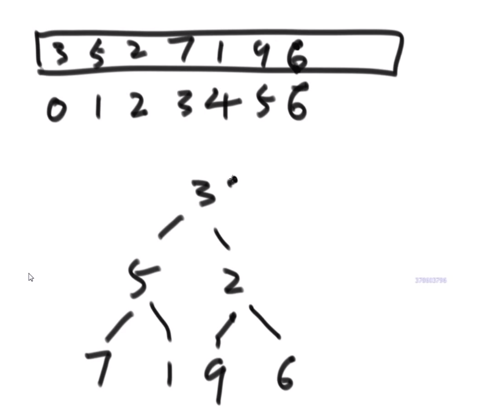

> 这样因为是使用数组方式存的节点，所有对于每个下标为 i 的元素
>
> - 他的左孩子，如果不是 null, 就会在 i*2+1 下标
> - 他的右孩子，如果不是 null, 就会在 i*2+2 下标
> - 他的父亲，就会在 (i-1)/2 下标 —> 如果是 root 也就是下标为 0 的，那么 (0-1)/2 照样还是 0, 还是他自己

------

#### 链表

> 记住如果链表带有换头操作，那么<font color='orange'>返回值设为 head</font>, 返回的就是最终答案的 head (好像和这个还有助于递归算什么东西)


------

#### 优先级队列和 java 的 Priority Queue

- 优先级队列底层就是堆结构，堆顶就是优先级最大的
- Java 里面的是 Priority Queue, 如果放的是数字，那么默认就是小根堆结构

这个底部是数组模拟二叉树的堆结构，所以会有时候加多了，需要扩容，扩容好像就是当前大小 x2, 然后把旧数组里面的拷贝到新建的大数组里面到对应的位置

> 一共加了 N 个数，经历了 logN 次，因为:
>
> 比如说 N=16
>
> - 我们加了两个数超了一下，扩容
> - 我们加了四个数超了一下，扩容
> - 我们加了八个数超了一下，扩容
> - 我们加了 16 个数超了一下，扩容
>
> 总共扩容了四次，也就是 logN 级别的 (log16=4)
>
> 而我们每次扩容的代价是 O (N) 时间复杂度的，所以所有的操作就会 O (NlogN), **也就是我们添加了 N 个元素的总代价就是 O (NlogN)**
>
> **而我们想要的是平均下来，每添加一个数，会是多少时间复杂度，也就是 `O(NlogN)÷N` , 也就是平均下来， 每添加一个元素，即便考虑了扩容问题，也就是 O (logN) 的时间复杂度**

> 所以扩容这个事，并不会影响__比如说让我们使用堆排序__最终的表现，以为我们每个元素的添加 /poll 形成的堆是 O (logN) 的时间复杂度的，这个扩容也是 O (logN) 的时间复杂度，所以并不会怎么影响我们 overall 时间复杂度的计算的

**这个是人家 java 底层帮我们维持的堆结构，我们无法对堆结构里面的某一个元素进行改变然后 expecting it to 再次形成堆结构**所以这个相当于是个不好的地方，我们自己创造堆结构的话可能会更 flexible 想改哪个改哪个，只不过之后自己要给那个调用 heapify 和 heap insert 让整个结构再次变成想要的堆结构

> 他就是个黑盒，你给他一个又一个，他可以按照结构给你一个又一个，你无法直接改变黑盒里面的东西，就算可以改也会是代价比较高的 (因为要扫描每一个找到那个被改的，然后进行各种操作变回堆结构)

------

#### 哈希表 (hashMap,hashSet)

java 的 hashMap 和 hashSet 底层就是哈希表实现的

- hashmap/hashset 增删改查任何操作不管数据以及有了多少，都是常数操作 O (1), 比较大的常数 (比数组直接寻址要大得多)
- treemap/treeset (有序表) 增删改查任何操作不管数据以及有了多少，都是 O (log (n))
- 注意要是往 treemap/treeset 里面放复杂数据类型或者自己定义的各种类型，需要你提供一个比较器，按照你定的规则来排序

有序表！


------

#### 二叉树以及各种 (先中后序) 递归，非递归遍历

二叉树的先序、中序、后序遍历

先序: **任何子树的处理顺序都是，先头节点、再左子树、然后右子树**

中序: **任何子树的处理顺序都是，先左子树、再头节点、然后右子树**

后序: **任何子树的处理顺序都是，先左子树、再右子树、然后头节点**

##### 递归序

**每个结点都会经过三次**


递归序:


> 前序，第一次到达当前节点就打印


> 中序，第二次到达当前节点就打印

> 后序，第三次到达当前节点就打印


##### 非递归遍历

###### 前序遍历

准备一个栈，

1. 第一步__将非空根结点压栈__

   出栈并打印

2. **先将刚刚那个出栈的节点的非空右子树结点压栈 (空了就不压呗)**

3. **后将刚刚那个出栈的节点的非空左子树结点压栈 (空了就不压呗)**

   > 还是先序，只不过非递归方式就是我们自己放入栈，要先把右边的压进去，再把左边的压进去

 当前栈顶的节点出栈并打印

1. 重复 2,3

直到栈空了，说明所有的都出栈了 (这里出站顺序就是前序，我们可以做各种操作), 所有的都出栈了就一定是在所有节点 (每次循环栈 pop 出来的) 左孩子都已经压栈然后出栈或者就是空的，所有右孩子也都已经压栈然后出栈或者就是空的

###### 后序遍历

两个栈，一个工具栈，一个收栈

1. 第一步__将非空根结点压栈__

 出这个栈，入收栈

1. **先将刚刚那个出栈的节点的非空左子树结点压栈 (空了就不压呗), 注意这里又是左边先了**
2. **后将刚刚那个出栈的节点的非空右子树结点压栈 (空了就不压呗)**

 出这个栈 (此时就是我们上面刚放的那个右孩子节点 (注意如果是空的话就不是这个了)), 入收栈

1. 重复 2,3

最后收栈的样子就是:


此时再将收栈的节点一个一个 pop 出，那么最后的顺序就是后续了！


> 可以这么理解:
>
> - 我们压入工具栈又取出的顺序就是 --> 头 右 左 (因为先压入然后先 pop 的头，然后先压入左边的又压入的右边的，然后 pop 的是先 pop 右边的再 pop 左边的)
> - 把这个顺序一个一个压入收栈里面就是想要逆序呗 --> 左 右 头 (__先压入头，再压入左，再压入右，所以最后取出的顺序就是 左 右 头 __也就是后序了！)

###### 中序遍历

1. 第一步__将非空根结点压栈__
2. 将当前栈里面的节点的左节点压栈，一直重复直到当前栈顶的那个节点没有左节点了

> **第一次**执行第二步
>
> 

1. pop, 打印 pop 出来的，再讲 pop 出来的右节点 **(如果不是空，如果没有右节点就不用管了，继续 pop 下一个栈顶然后打印然后看有没有右节点等等等)** 给压入栈中，然后对这个右节点 (可能代表的子树) 做第二步

这就做到了让头先入栈，接着左边再入栈一直入到底，

## 4. 查找

#### 二分

- 找出 mid position

- 看数组的 mid position 的元素跟我们要找的一不一样

  - 可以使用 `left + ((right - left) >> 1)` 防止溢出，移位也更高效
  - （L+R）/2 容易溢出

- 要是要找的数字更大我们就去 mid+1 到 right 找回调自己继续找

- 要是要找的数字更小我们就去 left 到 mid-1 找回调自己继续找

- 所有操作要在 while 循环，符合条件

   

  ```java
  left < = right
  ```

   

  ，如果 left>right 说明

  - 比如说找到最后一个元素一比要是当前找的更大就往右找也就是 mid+1 到 right
    - 因为当前是最后一个元素，说明 mid 算出来的就是他自己，此时要是 mid+1 然后还是那个 right 老值然后回调的话，收到的 left 就会比 right 更大，此时我们 return -1 说明二分到最后一个元素也不符合，所以没有要找的
  - 比如说找到最后一个元素一比要是当前找的更小就往左找也就是 left 到 mid-1
    - 因为当前是最后一个元素，说明 mid 算出来的就是他自己，此时要是 mid-1 然后还是那个 left 老值然后回调的话，收到的 right 就会比 left 更小，此时我们 return -1 说明二分到最后一个元素也不符合，所以没有要找的

```java
JAVA/* 注意：题目保证数组不为空，且 n 大于等于 1 ，以下问题默认相同 */
int BinarySearch(int array[], int n, int value)
{
    int left = 0;
    int right = n - 1;
    // 如果这里是 int right = n 的话，那么下面有两处地方需要修改，以保证一一对应：
    // 1、下面循环的条件则是 while(left < right)
    // 2、循环内当 array[middle] > value 的时候，right = middle

    while (left <= right)  // 循环条件，适时而变
    {
        int middle = left + ((right - left) >> 1);  // 防止溢出，移位也更高效。同时，每次循环都需要更新。
        if (array[middle] > value)
            right = middle - 1;
        else if (array[middle] < value)
            left = middle + 1;
        else
            return middle;
        // 可能会有读者认为刚开始时就要判断相等，但毕竟数组中不相等的情况更多
        // 如果每次循环都判断一下是否相等，将耗费时间
    }
  
    return -1;
}
```

> O (logN)-> 因为比如说 N=16, 那最多要看 4 次，而 24=16, 所以 log16=4, 所以 logN = 最多要看的次数

一般是用于已经有序的数组但这不代表无序就不可以用了！！！

比如说数组中无序，邻近数字不相等，想找出任意一个局部最小的数字 -> 局部最小指的是比左右元素 (如果有) 都要小的数字，也可以用二分查找，由费尔定理，肯定会找到一个的，这比暴力 O (N) in this case 更快

> 主要看情况，看适不适合

例题：


## 5. Master 公式


母问题被分为a个规模为N/b的子问题和其他规模为N^d的额外操作。


## 6. 排序，数组等问题

#### 找出数组范围最大值


- O (logN) 时间复杂度 -> 用 master 公式

------

#### 小和问题

就是你遍历数组，所有在当前元素左边且要比当前元素的数字相加就是当前元素的小和，算出每个元素的小和然后把他们相加


整个数组的小和，在这例子里面是 0+1+4+1+10=16

> **这个我们可以在使用归并排序的同时，多做些操作，计算出来答案**

我们换种想法，每个元素，他的右边有几个比自己大，比如说上面例子 

- 第一个元素是 1, 然后看右边有 4 个元素比自己大，所以我们需要 4 个 1
- 第二个元素是 3, 然后看右边有 2 个元素比自己大，所以我们需要 2 个 3
- 第三个元素是 4, 然后看右边有 1 个元素比自己大，所以我们需要 1 个 4
- 第四个元素是 2, 然后看右边有 1 个元素比自己大，所以我们需要 1 个 2
- 第五个元素是 5, 然后看右边有 0 个元素，所以我们需要 0 个 5

所以最后 4*1 + 2*3 + 1*4 + 1*2 = 16, 所以一样的

> 所以每次 merge 执行的时候，如果左边的要比右边的___要小___(注意 等于 不算！) 的话，就代表产生了小和，也就是当前左边这个值. **如果右边的这个数组是多个元素，那如果右边第一个比当前左边的这个元素要大，右边数组后面所有的元素都大，我们可以用<font color='orange'>右边数组下标</font>快速地 (\*其实这个就是更快的原因，直接就找到了多少个元素更大，而不是一个一个比\*) 计算出有多少个比他大的然后小和值就增加比他大的那个靠下标快速算出来的数量 \* 当前左边这个更小的值**

> **== 但是注意！！！这个 merge 过程跟我们之前的 merge 过程有点不一样 ==**
>
> 在这里， **我们如果左边和右边数组当前数是相等的**，我们不会先放左边的，而是先放右边的
>
> 
>
> 注意，正因为我们这里如果相等是先放了右边的，我们破坏了 merge sort 的稳定性，merge sort 在 O (logN) 的比较排序里面最有特色的就是他的稳定性，其他的都不怎么样 (比如说空间复杂度是 O (N), 是 O (logN) 的比较排序里面最大的)

和归并排序merge的区别就在于helplist的赋值加入了小和计算那一行


当然需要本身的排序也是实实在在的需要的，要是不排序那就不对了，比如说右组必须是排序的我们才可以用下标快速的算出有多少个比元素更大的 ->(下标快速算就是 O (1) 啊)


**每个小和都是没有遗漏的，分批的，没有重复的**

- 不遗漏 -> 因为 merge 过程中，是一定会把某一个数右侧范围扩到一个整体的
- 不重复 -> 因为已经变成一个部分的东西，在这个东西内部是不重复产生小和的，只是左组跟右组 merge 的过程中，因为左组的数比右组的小，才会产生小和，所以不重算

因为这个差不多就是 merge sort, 所以时间复杂度就是 O (NlogN)

------

#### 逆序对问题

比如说:

[3,2,4,5,0] -> 3,0 是个逆序队 3,2 是个逆序队 4,0 是个逆序队 etc…

**计算总共有多少个逆序队**

> 使用归并排序
>
> - 每次 merge 我们都看，左边当前元素是不是比右边的要大
>   - 如果大，直接用下标方式快速算出多少个大的
>   - 如果小__或者等于__, 就直接左边的这个，然后看左边的下一个元素进行比较，…
>
> **不难看出，跟小和问题贼像，只不过反过来了，而且没那么复杂了**

* 多想想像这种类似于 combination 的题，他问的不是 combination 哈，反正总是试试看 merge sort 能不能行，merge sort 就是可以快速找出左边和右边的某种区别 (一般是大于，小于这些的), 然后要是我们平常需要一个一个比，但是因为 merge sort 确保每次 merge 两边都已经是有序的，我们可以非常迅速靠着下标算出有多个匹配的！！！

------

#### 荷兰国旗问题


> 很简单
>
> - 遍历我们数组，下标 i 一开始是 0
> - 有个小于区域和大于区域 (**如果只想要小于一个数的在左边，其他的数不做要求就不需要大于区域，大于区域是为了把大于那个数的放到右边，这样既有小于区域和大于区域，那么如果有和那个数一样的，那么会出现在中间左右的位置**)
> - 如果当前元素 <那个数，把当前元素跟小于区域下一个元素互换，小于区域往前走一步 (用下标比如说 j++),i++
> - 如果当前元素 = 那个数，直接跳过让 i++
> - 如果当前元素 > 那个数，把当前元素跟大于区域上一个元素互换，大于区域往前走一步 (用下标比如说 k--),i__不变！__
> - ***当 i 和 k 的值一样了，说明都处理完了***，结束，完成！

如果只想要小于等于的放在左边，大于的放到右边的规则:

- 如果当前元素 <= 那个数，把当前元素跟小于等于区域下一个元素互换，小于等于区域往前走一步 (用下标比如说 j++),i++
- 如果当前元素 > 那个数，直接跳过让 i++

这就跟双指针一样的

------

#### 排序一个几乎有序的数组


priorityQueue当成一个黑盒，不需要考虑他的内部实现，只需要知道他能pop，pull

** 使用堆排序！！！*

- 首先我们有个数组，然后一个 k 值
- 我们首先把下标从 0 到 k 的所有数字放到一个小根堆 (这里使用小根堆是为了方便，因为我们取的就是从 0 下标开始的一些数字) 里面，这样我们就有了这个范围的小根堆，我们知道数组最小的数字肯定是在这里，因为最多不会超过 k, 不会出现在超过那个范围的！
- 我们接着取出堆顶也就是数组最小值把它放入数组下标为 0 的位置，注意我们小跟堆需要把那个堆顶 pop 掉！！！
- 我们再从数组的 k+1 下标的位置取出一个放入到小根堆，然后让那个 heap insert 或者什么什么的再次形成小跟堆
- 此时我们再取出堆顶也就是数组第二个最小的放入到数组下标为 1 的位置，注意我们小跟堆需要把那个堆顶 pop 掉！！！
- so on…
- 直到我们数组取不出元素了，到头了，我们就让现在的小根堆 pop 完后那个样子自己形成小根堆，然后取堆顶等等等就行了
- 最后我们数组都是有序了

我们小根堆每次只处理 k+1 个数，所以每次每一个元素 heapify 形成一个新的小根堆，其实就是 O (logk) 左右的时间复杂度

我们数组有 N 个元素，每个元素都要被放到小跟堆进行 heapify/heap insert, 也就是总共就共__O (NlogN) 的时间复杂度__

所以如果 k 的值很小，我们这个甚至就跟 O (N) 差不多了！所以堆排序很适合这个问题！！！

> 学到了 堆结构很管用！！！任何合适的都可以，任何想要我们选择某一个数，然后是按照某种跟其他的比较的规则，比如说比其他的都小 / 都大都可以！！！

> 注意我们可以用自己自定义的类的实例按照他们的属性的值来进行这个堆结构然后堆排序都可以，很自定义，很不错！

------

## 7.比较器和 java 底层的排序操作


就是一般:

- return 第一个参数 - 第二个参数，那么就是从小到大排 (貌似)
- return 第二个参数 - 第一个参数，那么就是从大到小排 (貌似)

> - java 的 priority queue 直接用默认是小根堆，要是想要大根堆就要创建个类实现 comparator 接口重写 compare 方法并把那个类实例化传给 priority queue 的构造函数才可以实现实例化出来的 priority queue 是别样的，比如说大根堆，或者我们那个 priority queue 放我们自定义的类，也可以按照我们的某个属性 (我们定的规则) 来吧对应的放到堆顶
> - 就是如果那个 compare 方法返回正数代表第一个参数 (或者那个类的某个属性的值等等等) 在顶堆，返回负数第一个参数放上面等等等
>
> 
>
> 大根堆就是第二个减第一个参数就行了，如果是正数说明会把第二个放到堆顶，第二个数更大，所以放堆顶是大根堆

> 还可以自己自定义各种复杂的比较策略

**java 底层的排序操作:**

**size 大于 60 时 使用 merge 和 quick 进行综合排序，如果小于 60，系统默认使用插入排序以求最快速度完成。**

**自己定义的 class 类型排序时，会使用 merge 排序， 为什么？？？原因当然是稳定性，自己定义的类型一般会想要稳定性的，快排又做不到稳定性。**

> 这是因为小样本量的时候，N 平方没那么起的快，反之插入排序的常数系数啥的更低，所以小样本量的时候用这些 N 平方更快一些些，按照情况使用不同排序的优点


------

## 8. 链表问题

不考虑空间复杂度用hashmap或hashset，重新复制利用链表next关系

考虑空间复杂度，可以利用快慢指针

####  找出两个有序链表共同值的节点

- 一个指针指向第一个链表头，另外一个指向第二个链表头
- 比大小，谁更小谁移动到下一个
- 如果遇到一样的，记录那个一样的，然后共同移动 (两个都往下一个移，说不定还有一样的)
- 任何一个链表到头了，结束

------

#### 两个链表是否有回文结构


**使用额外空间方式:**

- 把每一个元素放入栈里面
- 从栈取出的顺序就是链表的逆序，我们边弹出边比较一不一样，如果回文结构一定一样，所以直到栈弹空要是还是都一样那么就回文
- 如果有一步不一样，就不是回文


**稍微再省一些空间的方法:**

- 把链表右边的放在栈里面，然后再跟链表前一半比
- 栈只要弹空了就停
- 因为要是是回文结构，不管链表有的元素是不是偶数或者奇数个，反正比了左边和右边就会是一样的，就算是奇数个也不会 reach 到中间那个


但是我们怎么做到只把右边的放入栈？

**快慢指针！**

- 快指针比如说一次走两步
- 慢指针比如说一次走两步
- 这样最后快指针最后指向最后一个，慢指针差不多指到中间位置

> 这些快慢指针可以自己任何定制，按照自己想要的方式实现

我们想要

- 如果链表奇数个节点，我们慢指针指向中间那个
- 如果链表偶数个节点，我们慢指针指向中间的左边那个


**超级省空间的方法 (面试做的时候很加分):**

- 快慢指针，最后让慢指针指向差不多中间位置
- 中间那个节点的 next 指向 null
- 然后让那个节点后面的节点都逆序

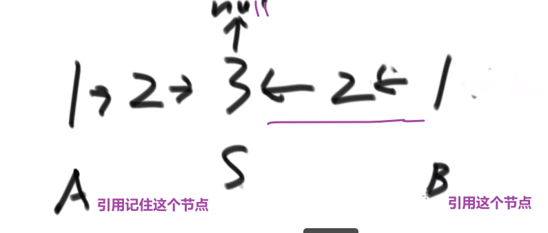

然后再 A 指针和 B 指针挨个比，一样的话就一块走下一个，如果有一个不一样就返回 false

**一直到最后有任何一个为空 (null), 就停止，就说明最终结果就是回文结构**

**注意如果最后返回 true 的话，有时候需要把链表的指向恢复一下，看需求吧**

> 这个对于偶数次的节点的链表也可以！自己想象一下！

这个方法就有限几个变量，最省空间的！！！


------

#### 逆序链表


> 还有什么递归方式等等等

------

#### 单链表按某值划分左边小，中间相等，右边大的形式


**笔试里面做法:**

把链表里面的数放到__Node 类型的__数组里面去，然后对数组玩 partition, 然后再把数组里面的数放回链表就行了

**面试里面做法 (省空间！):**

> 有很多类似于这种的问题，要多想想类似的看看这个解法适不适用

有些复杂我们用一个例子来讲解答案:

链表:

**对于划分的值是⑤**

需要六个变量:

| 变量名             | 等于什么     |
| ------------------ | ------------ |
| SH (一开始是 null) | 小于部分的头 |
| ST (一开始是 null) | 小于部分的尾 |
| EH (一开始是 null) | 等于部分的头 |
| ET (一开始是 null) | 等于部分的尾 |
| BH (一开始是 null) | 大于部分的头 |
| BT (一开始是 null) | 大于部分的尾 |

- 首先第一个节点④, 发现比我们的⑤小，所以让 SH 和 ST④
- 下一个节点⑥, 发现比我们的⑤大，所以让 BH 和 BT⑥
- 下一个节点③, 发现比我们的⑤小，所以让 ST 当前指向的节点④指向③, 然后让 ST 指向③(SH 不要动之后只有是一开始 null 的时候才会被第一个更新)
- 下一个节点⑤, 发现跟我们的⑤相等，所以让 EH 和 ET 都指向这个当前找到的⑤!!! **需要这个，因为可能有多个，我们要串起来所有相等的，然后让头代表第一个，尾代表最后一个 (可以看出是稳定的，保持了顺序，小于区域和大于区域都是同理)**
- 等等等
- 最后就是:


- ST 的当前指向的节点的 next 指向 EH
- ET 的当前指向的节点的 next 指向 BH

== 不过注意！！！== 可能压根没有小于区域，可能压根没有等于区域，可能压根没有大于区域！！！

> 所以只有不是 null 的时候才可以调用 next 连，如果有一个是 null, 需要连下一个区域等等等

完成，结束！


> 我们相当于用很多指针 (基本上就是两个指针一个头一个尾代表一个区域，然后可能有多个这种对子), 然后**我们就可以按照我们想来的规则**把代表不同区域的指针头和尾指向不同节点 (期间需要如果那个区域的尾指针要换成别的，就让当前的尾指针 (**如果不是 null**) 的 next 指向新的那个，这样才能全部最终正确得串起来)
>
> 说到底就是那个链表，我们只是对节点的 next 改变就可以做很多事请

------

#### 复制含有随机指针的链表

比如说:


**使用比较多额外空间方式:**

哈希表！HashMap!

- 遍历原来的链表，我们只需要把原来的链表的节点 (的指针) 和对应的新链表的新建的节点 (的指针) 作为 key 和 value 存入 hashMap


- 遍历老链表，或者遍历哈希表
- 对于每一个哈希表里面的值也就是新链表的节点的指针，我们让他的 next 指向这个新节点对应的 key (也就是老节点的指针) 的 next **指向的节点在哈希表里面对应的值**，然后让他的 rand 指向这个新节点对应的 key (也就是老节点的指针) 的 rand **指向的节点在哈希表里面对应的值**，就可以了

> 我们产生了一个 mapping (自己造的次) 相当于，就大概理念就这样！


**不使用比较多额外空间方式:**

- 生成一个个新节点，但是我们让他们跟老链表的节点这么串起来


- **我们让每一个新生成的节点的 rand 指针指向当前这个新节点对应的老节点的 rand 指向的节点的 next**


> 反正这种想法就是让老的节点和旧的产生连接，这样我们就可以按照老节点的方式连的连我们自己的这个新节点，毕竟我们想要的是复制嘛，肯定是照着来啊

- 这么做后，就会成这样:


- 接着就把 next 改变，让新链表从这里分离出来


------

#### 一个链表是否有环，如果有怎么找到入环点

一个有环的链表，和他的入环节点:


> 可以发现有环的最终不会指向 null, 所以最后要是走到了 null, 说明肯定没有环

**使用 HashSet 方式很容易:**

- 每个节点 (存节点的 HashSet, 不是节点的值！！) 存入哈希表之前先看看是不是已经有了，如果没有才存，如果有说明有环

**不适用那么多额外空间的方式:**

** 快慢指针！！！**

> 链表好多都是快慢指针和哈希表解法啊

- 两个指针方法，快指针慢指针
- 如果一个链表有环 (说明最终不会指向 null)
- 那么快指针一下走两步，满指针一下走一步
- 他们肯定会在有环的部分相遇的！ 并且满指针和快指针在环中转的圈数不会大于两次以上！！！
- 这个时候！接着让快指针指向 head, 然后跟慢指针一样一步一步走，直到他们相遇，他们相遇的那个节点一定是链表入环的节点！！！


------

#### 两个单链表相交


##### 如果两条链表都无环

**用 set 方式:**

第一条链表节点都入 set，第二条链表查，查到重复即为相交节点

**不用 set:**

- 遍历第一条链表，记录最后一个节点，且记录链表长度 （长度记作 x）
- 遍历第二条链表，记录最后一个节点，且记录链表长度 （长度记作 y）
- **如果两个最后节点不同**，则不相交 —> 如果相交最后一个节点肯定会是一样的


- **如果最后一个节点是一样的，那么** x 与 y 大的先开始走， 走 x-y 步 (如果相交，那么共享的部分肯定不会出现在那个 x-y 步里面，因为后面的长度都会是共享的部分，细品，细细品)
- **然后那个长的那个走完 x-y 步后，两条链表一起走，某一刻肯定会在相交的节点相遇**


##### 如果一条链表无环一条节点无环

> 这种情况绝对不会发生，因为只有 next 一个指针，只能最终指向一个方向

##### 两个都有环

> 如果两个有环链表相交，那他们一定是共用这个环

**一共有三种情况**

1. 两个有环但是不相交
2. 两个有环且相交点是同一个
3. 两个有环且是靠着环来相交的 (**这里我们认为任何一个链表的入环点就是相交点**)


- 如果 loop1 (第一个链表的入环点) 的内存地址等于 loop2 (第二个链表的入环点) 的内存地址 -> 则为第二种情况 (两个入环节点一样)
  - 那我们就用无环的方式就行了，差不太多的
- 如果 loop 1 不等于 loop 2
  - 让 loop1 沿着环走，如果没有遇到 loop2 则为第一种情况，也就是没有相交
  - 如果遇到了 loop2 就是第三种情况 (两个入环节点不一样)


> - 无非就是有了两个头节点和两个链表的入环节点
> - 如果入环节点一样，说明是第二种情况，就按照我们无环的做法一样就行，长的先走 x-y 步，然后两个一起一块走，一直走到一样的说明找到了相交点 (** 这个不一定他们的入环点，因为可能入环点之前就相交了，参考第二种情况的图片！！！**)
> - 如果如环节点不一样，我们就 while loop 让那个 loop1 入环节点走一圈，如果这一圈没遇到和另外一个 loop2 入换节点，说明是情况 1, 如果遇到了一样的说明是情况 3-> 返回 loop1 或者 loop2 都行，都叫做第一个相交的节点

------

#### 能不能不给单链表的头节点，只给想要删除的节点，就能做到在链表上把这个点删掉？

抖机灵

- 将删除节点的下一个结点的值赋值给删除节点
- 然后将删除节点的 next 指向下一个节点的下一个节点
- 然后删除下一个节点就行了

> **注意这个不能删除最后一个节点**


## 9. 二叉树

递归的遍历，每个节点都是经过了三次的，每次主函数就代表这次被经过了，然后在其他两个子递归的前中后插入print就行了

先中后序进行栈遍历的时候，注意栈的先进后出，比如后序遍历，左右头，那么两个栈，第一个栈头右左进，第二个栈就可以按照头右左出。

这种前中后遍历，利用这种思想，print函数那一块是可以改的，改成对当前节点做某些操作。比如判断是否是搜索树

####  求一个二叉树的最大宽度

比如说:


> 我们只需要在宽度遍历的时候能知道当前的节点是第几层就能开始计数了

使用 hashMap!

> 下面的听个大概意思就行，不需要死记硬背

- 一开始我们把那个头节点插入到队列中，我们也 put 一个 key 为那个头节点然后 value 为 1 (代表第 1 层) 到 hashMap 里面去
- 到了我们循环里面，每次我们让一个节点出列，我们就靠这个节点来查 hashMap 里面对应的 value, 也就是那个出列的节点的值
  - 如果取出的值跟我们当前操作的层次 (一开始设置为了 1) 一样，那么就说明当前是同一层的节点，我们就让保存那一层<font color='orange'>节点数量</font>的变量 ++**（注意这里比的是curNodeLevel和curLevel）**
  - 如果取出的值跟我们当前操作的层次 (一开始设置为了 1) 不一样，那么就说明当前是下一层的节点，说明上一层我们那个那一层节点数量的变量已经是计算完了那一层的数量
    - 我们就需要计算看这个跟我们当前用变量 max (一开始设置为了数字最小值) 比，如果更大，就要更新 max 值
    - 并且我们还需要把那个当前层数的变量 ++
    - 然后清空当前层一共多少节点的那个变量设置为 1 (因为当前就是这一层的节点，所以发现了一个)
- 然后就是之前的宽度遍历部分先让非空左节点的进队列
  - 我们把这个非空左节点作为 key 存入 hashmap, 他的 value 就是当前保存层数的变量 + 1
- 再让非空右节点的进队列
  - 我们把这个非空右节点作为 key 存入 hashmap, 他的 value 就是当前保存层数的变量 + 1


curLevelNodes初始化为0，因为从队列中poll出来之后才是第一个节点被访问到。

max保存的就是最大宽度


> **上面代码有点 bug, 比如说出列最后一个节点时，可能会没有到 Math.max (那里比较), 也就是没有比较最后一层**

------

#### 如何判断一颗二叉树是否是搜索二叉树

> 搜索二叉树就是每一颗子树，他的左孩子都要比头小，他的右孩子都要比头大
>
> 经典的搜索二叉树没有重复的

**答案:**

我们直接使用中序递归–> 左中右，如果是搜索二叉树，那么最后中序递归出来的顺序一定是**升序**的

如果某个点不是升序的，那就不是搜索二叉树

**递归方法:**

​	**父节点判断左子树是否是搜索二叉树，对其判断，成功后，还需要对自身判断，定义一个prevalue作用就是存储之前的最大的那个数，head的value和prevalue做对比符合才可以。递归中不仅要对子进程判断，还要有对当前进程的一些逻辑判断**。


> 递归的想法就是把问题缩小到你最关心的大小上，比如说这里最主要的是每一个节点 (mergesort 最小的就是两个连着的元素，等等等), 然后这里这个可能不是最小的，比如说 leaf 也是一个节点，但他的左孩子和右孩子是 null, 我们一般不会用到 null 做什么处理，就测如果 head==null 那就怎么怎么样直接返回等或者返回 true/false. 这样就足够了，因为回调自己的 null 左 / 右子节点都会遇到这个。接着就是在合适的顺序，处理那个那个你关心的最小单位，爱这里处理你只要关心你那关心的节点就好了 (可能一个，可能两个，等等等), 当然他们的结果可能是当前回调自己参数传进来的，可能是来自之前回调自己的结果等等等，反正你可能会有多个自己的调用，顺序很重要，返回值也重要！
>
> 我们把关心的那个范围的节点处理好了，我们只要保证其他节点 (或其他) 都要经过我们设置的操作就行，如果是返回什么值，一定要注意所有可能性，有没有需要多些 if 看看情况等等

> 就是我们左边子树需要先判断，也就是一直到左节点，这里我们再跟我们那个比较逻辑比，然后返回上一层，上一层会调用右边的逻辑也是那一层的 head 比 (还没必过！) 然后让右子树也这么做，要是都对了返回 true 到他的上一层，到了这一层又要拿那一层的 head 跟那个比，然后右子树也这么做 (因为还没处理过).
>
> 但是我们如果这整个有哪个返回 false, 我们直接作为上一层的左子树调用，返回了 false, 然后我们那个一层还没判断这个左边的是不是 false 就直接拿他的一层的 head 比较，万一比过了，那就是 true 了，明明他的左子树没有符合，但他这一层却把整个他所代表的他自己 (head) 和他子树的结果返回为 true 了，这肯定不对！！！我们要先测左边的对不对，要是不对，直接让这个一整层就返回 false,head 也不用比了，右子树也不用比了，直接一直返回到一开始的 (栈底) 的那个一层然后直接返回 false 作为整个方法的结果.

比较费空间的写法:


然后再主函数调用这个方法传参数，接着我们只要对那个传进去的 list 在这个方法结束后遍历一下，看看是不是升序的就行了

**非递归方法:**


> 同理：我们当然可以做到–> 后头左，这个样子的中序，看你什么需求了

------

#### 如何判断一颗二叉树是否是完全二叉树

> 完全二叉树就是要么全满，要么左边往右填，右边的还没满

答案: **使用宽度遍历！**

1. 遇到的每一个节点，如果这个节点有右孩子没有左孩子，直接返回 false
2. 在第一个条件不违规的情况下，如果遇到的第一个节点他要么只有左孩子，或者两个都没有 (符合第一个条件), 那么之后的**所有节点都必须是叶节点**，如果不是则返回 false, 如果都是返回 true


------

#### 如何判断一颗二叉树是否是满二叉树

麻烦但好理解的做法:

- 有个函数统计这个树的最大深度 (D)
- 有个函数统计这个树的节点个数 (N)

> 满二叉树一定符合 **N = 2D-1**

------

#### 如何判断一颗二叉树是否是平衡二叉树 (以及树型 dp 套路介绍⭐️重要！！！)

> **这里就可以说到了二叉树题目 (判断是不是满二叉树，是不是搜索二叉树等等等) 的套路！注意这里的逻辑，很重要！以后遇到问题这么来没差**

> 平衡二叉树就是对于任何一个子树来说，他的左子树的层数和他的右子树的层数**相差最多为 1**

对于一个头节点来说

- 他的左子树是平衡的
- 他的右子树是平衡的
- 然后 | 左高 - 右高 | <= 1

才可以代表这棵树是平衡二叉树

> 所以我们需要
>
> - 左边是不是平的？以及高度是多少？
> - 右边是不是平的？以及高度是多少？
>
> 所以我知道，左树和右树<font color='orange'>需求是一样的</font>，那就递归
>
> 递归中，将需要的信息作为递归函数的返回值，这里新建一个struct


##### 同理看是不是搜索二叉树还是使用同一个套路 (递归)

就像给了我们一个节点，问我们这个节点以及他下面的这个树是不是搜索二叉树

- 首先左边是个二叉树
- 右边是个二叉树
- 并且左树的最大值应该小于我 (这是对于每一个子树 (有左孩子的) 来说，因为是递归，确实啊，没毛病)
- 并且右树的最小值应该大于我 (这是对于每一个子树 (有右孩子的) 来说，因为是递归，确实啊，没毛病)

**== 我们可以跟他的_左树要信息\*，可以跟他的_右树要信息*，我们再看有什么需求 (要什么信息)==__

我们需要左树的信息

- 是不是搜索二叉树
- 这个左树的最大值

我们需要右树的信息

- 是不是搜索二叉树
- 这个右树的最小值

> 但是！我们递归全都是一样的，参数等等等
>
> 所以， **不管是哪边的树，我们都会让他返回三个信息**
>
> - 是不是二叉树
> - 最小值
> - 最大值

代码:

首先是自定义返回值:


##### 同理看是不是满二叉树还是使用同一个套路

比如说给我们了一个头节点，我们要看是不是满二叉树，我们

- 首先知道他左子树的高度以及多少个节点
- 再知道他右子树的高度以及多少个节点

我们可以结合当前节点的信息 (高度加 1, 节点加 1), 然后调用这个这个 formula—>**N = 2D-1**

> 满二叉树一定符合 **N = 2D-1**

**我们需要左子树的信息:**

- 多少个节点
- 最高什么高度

**我们需要右子树的信息:**

- 多少个节点
- 最高什么高度

所以我们自定义返回值就是有这个两个属性


**模板**


**正确答案:**


主函数调用:


> 这里相当于是先把所有要的值都获取了，然后才一块判定对不对
>
> **而不是之前那种让每一个左树 / 右树附带一个 isFull 这种数据作为返回值等等等**

##### 树型 dp 套路

使用前提：


这个不一定可以解决所有二叉树问题，但是可以解决所有树型 dp 类型的题

> 比如说，需要看整棵树才可以决定的答案，这种需要结合所有情况来看的，不过这种一般都是没有优化的方法，都是暴力解，面试中一般不会考的

**树型 dp 的题就是解一个题可以通过跟左树和右树要信息，把这个事给解决了，只要是这种类型的，都可以这个套路解决**

> 所以发现套路了吧！！！
>
> - 我们一般都是自定义返回值，里面存着我们想要的 (不管是左树还是右树还是什么) 各种信息
>
> - 然后递归方法里面，首先返回值肯定是我们的那个自定义的返回值，然后一般接收参数也是一个节点 (当前的头节点)
>
>   - 我们 base case, 这里一般要看你感兴趣的范围以及返回的值都是看你需求
>
>   - 接着调用自己传参传当前节点左边的树，然后这个返回一个我们自定义类型的值代表我们每一颗子树都有可能返回的值 (不用管那么多其实，就当做是黑盒，你只管调用自己就行)
>
>     反正最后会返回给你那个想要的左边树的信息
>
>   - 接着调用自己传参传当前右节边的树，然后这个返回一个我们自定义类型的值代表我们每一颗子树都有可能返回的值 (不用管那么多其实，就当做是黑盒，你只管调用自己就行)
>
>     反正最后会返回给你那个想要的右边树的信息
>
>   - *_我们接下来必须要考虑有了左边数的信息和右边树的信息，他们怎么和我们当前这个节点比，才能让他们连起来 (这个很重要！！！)*_
>
>     - 我们首先可以给那个自定义类的每个属性定义一个变量代表
>     - 接着对着每一个变量，让他们，结合着左边数的信息和右边树的信息来设对应的值
>     - 然后我们再把这些值封装成我们自定义类然后返回，作为我们这个当前整个树的返回值 (这个因为会是递归，会被每一个能算是被叫成树的 (有左孩子 / 右孩子 / 都有等等等) 都会执行这一块)
>
> 再多说几句:
>
> 我们在最后处理当前节点的，只要考虑我们左边数的信息和右边树的信息就行了，比如说左边数的信息和右边树的信息里面有最小值，直接用，那肯定就是我们左树 / 右树一个一个算出来最后到了那一层算出的最小值 (**就认为左 / 右树给的信息就是全量的–> 我们想要的信息都有，“比如 36,37 行的递归代码，我管你怎么执行，反正你把我要的结果给我了”**), 然后我们这一层再比，跟当前节点比，如果当前节点更小，那么更新那个最小值，由此可见，其实最小值就是这么更出来的，最后这个也会返回到上一层！

这个套路可以解决一切面试里面的树型的 dp 题

------


#### 树型 dp 题之二叉树节点间最大距离问题


两种可能性

1. 不包括头节点 x, 说明就是要么 x 的左树 / 右树有两个节点他们之间距离最大
2. 包括头节点 x, 说明就是 x 左树最深的节点到 x 右树最深的节点 (也就是 `左高+右高+1(x他自己)` )

所以就是<font color='red'>左边取最大距离</font>，<font color='red'>右边取最大距离</font>，然后<font color='red'>左高 + 右高 + 1 </font>(x 他自己), 这三个当中取最大值

> 这种按照头节点包不包括的可能性分类就是经验，这种可能性的分类很重要！

树型 dp 套路

- 左树和右树都需要最大距离 (这个最大距离就是按照每一层的节点以他来看高度的得出来的) 和高度信息


#### 树型 dp 题之排队最大快乐值问题

> 这个是个多叉树的结构


解法:

假设 x 头节点，然后直接孩子是 a,b,c


- x 参与，代表 abc 就无法参加，那么整颗 x 代表的树的最大快乐值就是

```
x快乐值+a整棵树在a不来的情况下最大的快乐值+b整棵树在b不来的情况下最大的快乐值+c整棵树在c不来的情况下最大的快乐值
```

- x 不参与，代表 abc 可以参加也可以不参加，那么整颗 x 代表的树的最大快乐值就是

```
0 + Math.max(a整棵树在a来的情况下最大的快乐值,a整棵树在a不来的情况下最大的快乐值) + Math.max(b整棵树在b来的情况下最大的快乐值,b整棵树在b不来的情况下最大的快乐值) + Math.max(c整棵树在c来的情况下最大的快乐值,c整棵树在c不来的情况下最大的快乐值)
```

所以对于我们的所有子树 (多叉树), 我们需要:

- 那个子树包括子树节点来的最大值
- 那个子树不包括子树节点来的最大值


> 树型 dp 套路可以对多叉树也可以用，都是那个想法

------

#### 两个二叉树节点的最低公共祖先


比如说:


- D 和 E 的最低公共祖先是 B
- E 和 F 的最低公共祖先是 E

所以问题就是整个二叉树的头给我们，然后给了那个 node1 和 node2

> 潜规则，node1 和 node2 一定是属于 head 为头的这个二叉树的节点

- 使用 HashMap 来存**每一个节点 (key) 和他的父亲 (value)**
- 接着把 head 和这个 hashMap 作为参数传进一个递归方法
- 这个递归方法里面的套路就是模板 (有稍微一点不一样)(只不过我们这里没有返回值，不用自定义返回值类型，我们只是改 hashMap 里面的数据)
- 这里的递归是process类型，是对整个二叉树进行遍历处理。

我们在这个递归方法里面:

- base case
- 把左节点作为 key 和当前 head 作为 value 存进 hashmap
- 把右节点作为 key 和当前 head 作为 value 存进 hashmap
- 调用自己左子树传进去 hashMap
- 调用自己右子树传进去 hashMap


这个样子所有左子树会把他的所有节点和对应的父亲都设置好放进了 hashMap, 所有右子树会把他的所有节点和对应的父亲都设置好放进了 hashMap, 我们就可以返回到我们的主函数里面再做操作

- 首先，我们 **整个的大头 head (只有这一个！)** 他的父节点是没有设置的，所以在主函数一个设置一下
- 然后使用一个 hashSet 把 node1 (或者 node2) 先放进去
- 然后接着一直放，放到头节点 (包括) 为止，此时这个 hashSet 就是这个 node1 到头节点的道路经过的节点
- 然后接着我们可以使用 hashMap, 让 node2 检查是不是已经在那个 hashSet 里面了，如果没有一个一个往上升 (变成他自己的父亲), 然后一个一个检查，直到查到一样的 (可能是 head 主的那个头节点), 然后返回那个节点就行了，因为就是从下往上的 (通过成为找父亲，找父亲的父亲), 要是有一样的 (一定会有的，因为最后肯定都是 head), **那么一定就是最低的公共祖先**


##### 更短，但是很难理解的方法

> https://www.bilibili.com/video/BV13g41157hK?p=7&spm_id_from=pageDriver
>
> 1:35:00, 比较抽象

有两种可能

1. O1 是 O2 的 LCA (最低公共祖先), 或者 O2 是 O1 的 LCA

   > 那么我们直接把那个更上面的那个返回出来，另外一个没有遇到 (根本不去), 代表最后只有一个然后另外一个是 null
   >
   > 那么整体返回的就是那一个，也就是对的

2. O1 和 O2 不互为 LCA, 要往上才能找到

   > 那么这两个都会被找到然后往上传，一直传到他们的 LCA 就会直接返回那个 LCA


------

#### 二叉树找一个节点的后继节点

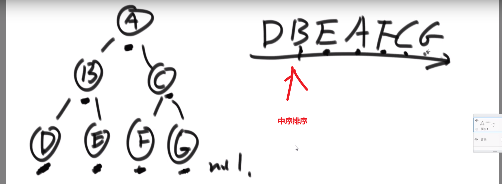

这里 ->D 的后继节点是 B,B 的后继节点是 E,E 的后继节点是 A,…G 的后继节点是 null

也就是中序排序中的一个节点后一个节点

> 同理，前驱节点就是后继节点反过来–> 中序排序的一个节点的前一个节点

题目:


> **我们之前做法可能就是遍历一下然后把所有的按照中序排好存到一个 set 里面**，然后看节点后面的节点是什么就行，但是这样会耗空间因为有那个 set, 我们这里有很好的解法:
>
> 首先弄一个三层的二叉树，找各种情况，必须要捋清楚，别想当然

我们这里每个节点都有 parent 指针指向他的 parent, 所以没有必要像之前的做法

我们完全可以让那个节点他的 parent 指针找到对应的后继节点就行了

- 假设我们节点是在第三层然后他的 parent 也就是他的后继节点在第二层，那么只需要走一步就行了
- 假设我们节点是在第三层然后他的 parent 的 parent 也就是他的后继节点在第一层，那么只需要走两步就行了

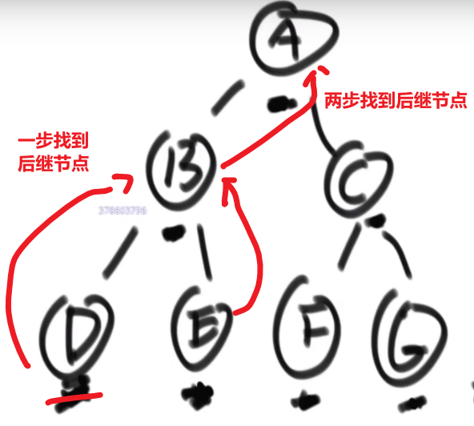

> 还有各种可能，或许不是通过 parent 等等等，看代码！！！

**所以，假设我们节点和他的后继节点之间的距离是 k, 那么我们可以有个 O (k) 时间复杂度的解法**

比如说给了个节点 X 找后继节点，有几种情况:

- X 有右子树的时候，那么右子树的**最左**的 leaf 节点就是这个 X 的后继节点 (因为中序遍历，搞完 X 就去的右子树，他的右子树会先去搞他的左子树，等等等)

- X 没有右子树，那么就会看 parent 然后看是不是我父亲的左孩子

  - 如果是，那么这个父亲就是我们的后继节点
  - 如果不是，那就继续往上看，一直看是头还不是，那就代表我们这个 X 是整颗数最右的叶节点，中序排序最后一个节点，没有后继节点，返回 null
  - 如果不是，那就继续往上看，一直看是为止，此时那个父亲 (我们这个是左孩子了) 就是我们的 X 的后继节点

  

  > 这是因为对于我们 Y 节点来说，我们的 X 就是 Y 的左子树最右的叶节点，也就是中序排序中他前面的那个节点 (打印完 X 就打印 Y)

  

------

#### 二叉树的序列化和反序列化


> 就是我们这颗树的**结构**以及他的**值**都能对应一个字符串，这样我们可以序列化 (内存变成字符串), 然后接着反序列化 -> 字符串还原出来之前那棵树的结构以及值

好几种做法

1. 先序

序列化:


> 可以看出不一样，easy


反序列化:

- 因为我们序列化是用 _  作为每个数的结尾，我们可以把_之前的每一个数都存入存入数组中
- 当初按照先序序列化的，现在按照先序反序列化
- 然后读数组第一个值作为 head, 然后再看下一个数作为 head 的左边的节点，so on…
- 如果遇到一个 #代表 null, 我们返回上一层，看那一层的右节点，so on…

> 这不就递归嘛！


------

#### 凹凸折痕

假设一张纸，给你个 N, 让你算出这张纸折叠 N 次，让你给出这张纸平摊后从上到下的折叠方向

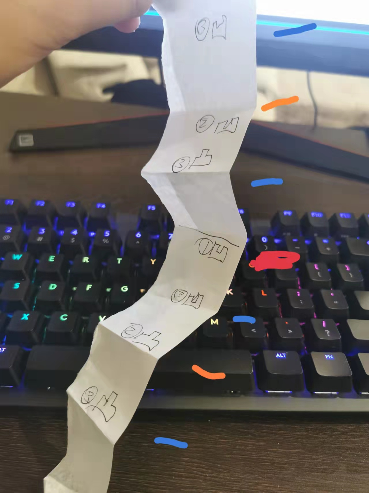


> 整个就是二叉树
>
> - 左子树都是凹折痕
> - 右子树都是凸折痕
> - 然后整个的头节点就是凹折痕


> 就是中序遍历，因为毕竟要求是从上到下的折叠方向也就是先把那个比如说 3 凹打印，然后 2 凹，3 凸等等等

**我们这里的空间复杂度是 O (N),N 是那个传进来的 N 值，因为我们最深 (递归) 打印到 N 层，所以很省空间**

要是让我们暴力，可能会发现凹凸折痕是 2N-1 个，然后我们就挨个存上面的，然后挨个打印，那么空间复杂度就到了 O (2N) 级别了

我们这里直接递归，最多就是空间复杂度是 O (N), 因为我们最多深入到 N 层，之后返回就会挨个清空，之后要是还再深入也还是用我们之前清空的空间，也就最多 O (N) 空间复杂度

------

### 二叉树的 Morris 遍历


> Morris 遍历，每个有左子节点的节点都会被访问两次，没有左子节点的只会被访问一次


> 时间复杂度就是 O (N), 因为每一个节点都最多被访问两次所以其实就是 O (n)(具体看视频)
>
> 空间复杂度就是 O (1), 就用了那几个指针

#### 先序遍历

1

2 3

4 5 6 7

morris 序列 1 2 4 2 5 3 6 3 7

打印 morris 序列中第一次出现的元素就是先序遍历

（有左孩子即会出现两次）

先序 1 2 4 5 3 6 7

```java
JAVA//第一次到达时，打印
	public static void morrisPre(Node head) {
		if (head == null) {
			return;
		}
		Node cur = head;
		Node mostRight = null;
		while (cur != null) {
			mostRight = cur.left;
			if (mostRight != null) {
				while (mostRight.right != null && mostRight.right != cur) {
					mostRight = mostRight.right;
				}
				if (mostRight.right == null) {
          // 有左树，第二次到达时打印
					System.out.print(cur.value + " ");
					mostRight.right = cur;
					cur = cur.left;
					continue;
				} else {
					mostRight.right = null;
				}
			} else {
        // 没有左树，第一次就打印
				System.out.print(cur.value + " ");
			}
			cur = cur.right;
		}
		System.out.println();
	}
```

#### 中序遍历

对于出现两次的元素，第二次打印，只出现一次的元素，第一次出现就打印

morris 序列 1 2 4 2 5 3 6 3 7

中序 4 2 5 1 6 3 7

```java
JAVA
public static void morrisIn(Node head) {
	if (head == null) {
		return;
	}
	Node cur = head;
	Node mostRight = null;
	while (cur != null) {
		mostRight = cur.left;
		if (mostRight != null) {
			while (mostRight.right != null && mostRight.right != cur) {
				mostRight = mostRight.right;
			}
			if (mostRight.right == null) {
				mostRight.right = cur;
				cur = cur.left;
				continue;
			} else {
				mostRight.right = null;
			}
		}
     //只能到达一次的第一次打印，可以到达两次的第二次到达才打印
		System.out.print(cur.value + " ");
		cur = cur.right;
	}
	System.out.println();
}
```

#### 后序遍历

对于可以到达两次的元素，第二次回到该元素时，逆序打印右边界

整个树遍历后，逆序打印整棵树的右边界

原理为：

一个树可以被右边界分解掉，由左往右，每次逆序打印其右边界，就是后序遍历

中途要求逆序打印，但 morris 要求 O（1）空间，即排除了使用额外空间的办法

可以使用反转链表来实现逆序打印

```java
JAVApublic static void morrisPos(Node head) {
	if (head == null) {
		return;
	}
	Node cur = head;
	Node mostRight = null;
	while (cur != null) {
		mostRight = cur.left;
		if (mostRight != null) {
			while (mostRight.right != null && mostRight.right != cur) {
				mostRight = mostRight.right;
			}
			if (mostRight.right == null) {
				mostRight.right = cur;
				cur = cur.left;
				continue;
			} else {
				mostRight.right = null;
         //第二次回到该节点时，逆序打印此节点
				printEdge(cur.left);
			}
		}
		cur = cur.right;
	}
   // 结束之后，打印整个树的右边界
	printEdge(head);
	System.out.println();
}

//先链表反转，遍历后再反转回去
public static void printEdge(Node head) {
	Node tail = reverseEdge(head);
	Node cur = tail;
	while (cur != null) {
		System.out.print(cur.value + " ");
		cur = cur.right;
	}
	reverseEdge(tail);
}

public static Node reverseEdge(Node from) {
	Node pre = null;
	Node next = null;
	while (from != null) {
		next = from.right;
		from.right = pre;
		pre = from;
		from = next;
	}
	return pre;
}
```

#### 判断是否为二叉查找树

中序遍历为递增序列则为二叉查找树

使用 morris 遍历

```java
JAVApublic static boolean isBST(Node head) {
	if (head == null) {
		return;
	}
	Node cur = head;
	Node mostRight = null;
   Integer pre= null;
	while (cur != null) {
		mostRight = cur.left;
		if (mostRight != null) {
			while (mostRight.right != null && mostRight.right != cur) {
				mostRight = mostRight.right;
			}
			if (mostRight.right == null) {
				mostRight.right = cur;
				cur = cur.left;
				continue;
			} else {
				mostRight.right = null;
			}
		}
     // 如果上一个值大于等于当前值，则这个树一定不是 bst
        if(pre !=null && pre>=cur.value  ){
          return false;
        }
     pre =cur.value; 
		cur = cur.right;
	}

   return true;
}
```

#### 求二叉树最小高度

给定一棵二叉树的头节点 head

求以 head 为头的树中，最小深度是多少？

递归办法

```java
JAVApublic static class Node {
		public int val;
		public Node left;
		public Node right;
 
		public Node(int x) {
			val = x;
		}
	}
 
	public static int minHeight1(Node head) {
		if (head == null) {
			return 0;
		}
		return p(head);
	}
 
	// 返回x为头的树，最小深度是多少
    // 使用递归求解
	public static int p(Node x) {
		if (x.left == null && x.right == null) {
			return 1;
		}
		// 左右子树起码有一个不为空
		int leftH = Integer.MAX_VALUE;
		if (x.left != null) {
			leftH = p(x.left);
		}
		int rightH = Integer.MAX_VALUE;
		if (x.right != null) {
			rightH = p(x.right);
		}
		return 1 + Math.min(leftH, rightH);
	}
```

morris 办法

需要做到以下两点

每到一个节点，可以知道它的高度

每到一个节点，可以判断出是否为叶子节点

```java
JAVA// 根据morris遍历改写

public static int minHeight2(Node head) {
	if (head == null) {
		return 0;
	}
	Node cur = head;
	Node mostRight = null;
	int curLevel = 0;
	int minHeight = Integer.MAX_VALUE;
	while (cur != null) {
		mostRight = cur.left;
		if (mostRight != null) {
         int rightBoardSize = 1;
         while (mostRight.right != null && mostRight.right != cur) {
           // 由下往上的元素层数
           rightBoardSize++;
           mostRight = mostRight.right;
         }
         if (mostRight.right == null) { // 第一次到达
           curLevel++;
           mostRight.right = cur;
           cur = cur.left;
           continue;
         } else { 
           // 第二次到达，需要减去rightBoardSize
           if (mostRight.left == null) {
             //此时到达叶节点，计算最小高度
             minHeight = Math.min(minHeight, curLevel);
           }
           curLevel -= rightBoardSize;
           mostRight.right = null;
         }
		} else { 
       // 只有一次到达
			curLevel++;
		}
		cur = cur.right;
	}
	int finalRight = 1;
	cur = head;
	while (cur.right != null) {
		finalRight++;
		cur = cur.right;
	}
   // 单独去找一下最右部分的最小高度
	if (cur.left == null && cur.right == null) {
		minHeight = Math.min(minHeight, finalRight);
	}
	return minHeight;
}
```


## 10. 图问题

#### 拓扑排序算法 (topological sort)

- 适用于 Directed Acyclic Graph --> directed graph with no loops (无环–> 指的不只是自己指向自己的那种环，还包括多个节点形成的环)


比如说：工程中的依赖


> 注意不能拥有环，也就像工程中依赖之间不能循环依赖一样

对于上方的图，我们可以看到我们先需要 E 依赖，然后 C 依赖然后 D 依赖，然后 B 依赖，然后 A 依赖

问题例子:


解法:

1. 我们首先入度为 0 的 (如果要拿 topological sort 来解答的话那就一定有这个)(一开始就是 A 节点)

 这个节点就相当于是 (此时) 必须先要有的依赖，然后其他的依赖才可以设起来

1. 接着把这个节点以及他的 outward edge 都擦掉 (肯定只会有 outward, 因为我们找到的是入度为 0 的),

   记得把这个节点保存啊，进行什么操作啊等等等

2. 重复 1,2–> 因为我们上面把 A 以及他的 outward edge 都擦掉了，此时 B 就是入度为零的节点，等等等

最终的 topological sort 顺序就是:


> 注意如果有多个入度为 0 的节点，那随便哪一个都行，反正我们之后顺序一定不会产生需要依赖的在前面然后被依赖的那个在后面.


------

#### 最小生成树以及相关算法 (和一些 terminologies)

关于图的几个概念定义：

** 连通图：** 在无向图中，若任意两个顶点 vivi 与 vjvj 都有路径相通，则称该无向图为连通图。
** 强连通图：** 在有向图中，若任意两个顶点 vivi 与 vjvj 都有路径相通，则称该有向图为强连通图。
** 连通网：** 在连通图中，若图的边具有一定的意义，每一条边都对应着一个数，称为权；权代表着连接连个顶点的代价，称这种连通图叫做连通网。
** 生成树：** 一个连通图的生成树是指一个连通子图，它含有图中全部 n 个顶点，但只有足以构成一棵树的 n-1 条边。一颗有 n 个顶点的生成树有且仅有 n-1 条边，如果生成树中再添加一条边，则必定成环。
** 最小生成树 (minimum weight spanning tree)：** 在连通网的所有生成树中，所有边的代价和最小的生成树，称为最小生成树。


> 可以用 kruskal 或者 Prim 生成最小生成树

------

#### kruskal 算法（K 算法） 适用范围：要求无向图 (undirected graph/graph)

此算法可以称为 “加边法”，初始最小生成树边数为 0，每迭代一次就选择一条满足条件的最小代价边，加入到最小生成树的边集合里。

- 可以想象一开始每个点就是一个集合 (甚至可以想象是整张 graph 是 n 棵树组成的森林然后把图中的 n 个顶点看成独立的 n 棵树组成的森林)

- 我们接着按照图中所有的 **edges 最小 weight 的那个开始 (升序一个一个来)**

- 然后对于那个 edge, 我们检查他的 u (from) 节点和 v (to) 节点是不是在一个集合中 (**也就是这个边连接的点是不是已经是同一棵树了还是两颗不同的树**)

  - 如果不在我们就把这个 edge 加入到我们最小生成树里面，然后把 u 和 v 放到一个集合里面去，

    ------> 当前的边进入最小生成树的集合中不会形成环

  - 如果在我们不会把 edge 加入到我们的最小生成树里面，(这说明他们之间已经有路 (path) 了，不需要这个 weight 更高的路)

    ------> 当前的边进入最小生成树的集合中会形成环

- 然后当我们的 edges 都处理完，说明我们最小生成树就有了

> 这种需要并查集结构才好实现–> 我们这里只是模拟，之后会学到并查集


#### Prim 算法（P 算法）适用范围：要求无向图 (undirected graph/graph)

此算法可以称为 “加点法”，每次迭代选择代价最小的边对应的点，加入到最小生成树中。算法从某一个顶点 s 开始，逐渐长大覆盖整个连通网的所有顶点。

- 任意一个节点开始

- 我们搜索他的 edges, 然后找那个最小 weight 的，看那个 edge 连着的节点是不是已经访问过 (加入到 set 了)

  - 已经访问过，那就继续看下一个最小 weight 的 edge 连接的节点
  - 没有访问过，那就把这个节点存入到 set 里面去，并记录这个 edge, 接着把这个新纪录到 set 里面去的节点所有的 edges 放入到小根堆里面，继续找出现在所有的解锁的小根堆里面的有的 edges 按照我们给的比较器规则会找出那个当前最小的 weight 的那个 edge

  重复，so on…

  (这期间可能会把同一个 edges 多次存入到小根堆，这个没事，因为之后我们取出来都会看那个 toNode 是不是已经是在 set 了，如已经在了那个 edge 也不会被处理) 结果就是找到最小生成树，result 存的都是一个一个最小生成树的 edges


> 所以要是问题只是告诉你只是一个连通的，那就没必要那个 for 循环

------

#### 迪杰斯特拉算法

求解单元点的最短路径问题：给定带权 (weight) 有向图 G 和源点 v，求 v 到 G 中其他顶点的最短路径

限制条件：**图 G 中不可以存在 negative cycle (肯定不行), 也不可以有 negative weight (貌似)**

> The algorithm creates a tree of **shortest paths from the starting vertex, the source, to all other points in the graph.**

比如说:


**要是有 A 节点无法抵达的节点，那么之间的距离就是无限**

迪杰斯特拉算法总共就干了两件事：

【1】不断运行广度优先算法找可见点，计算可见点到源点的距离长度

【2】从当前已知的路径中选择长度最短的将其顶点加入 S 作为确定找到的最短路径的顶点。

> 有点贪心的意思，每次都锁死一个值，这也为什么不能有 negative weight 因为要是有了那肯定会让之前已经锁死的边的值变，那就不对了

- 一开始存答案的 hashmap, 每个 key 对应一个图中的节点然后 value 就是 source 到那个节点的最小 weight, 一开始 source 到自己是 0 其他都是无限
- 先从 source 出发，然后找到他所有的 edges
- 然后把当前自己的 hashmap 中的值加上每个 edge 的 weight 值然后跟那个 edge 连向的节点当前数组中 hashmap 中的值比较，然后把 hashmap 值改成最小的那个值
- 处理完这个所有 edges, 我们就相当于结束了由 source 开始的所有 edges (我们也可以锁定当前节点在 hashmap 中的值，因为是第一次所以我们这次锁定就是 source 自己再 hashmap 中的值也就是 0, 他的距离到他自己就是 0)
- 然后我们从 hashmap 中选出除了以及当过当前节点的比如说 source 的所拥有的最小值的那个节点，然后让那个节点进行一样的操作 (看 edges 然后对于所有的 edges 的 toNodes 让他们的更新), 然后之后我们就把当前的这个节点在 hashmap 中的值锁死，然后让下一个…so on…
- 直到所有的都锁死了就结束，此时 hashmap 中存的值就是从 source 开始到图中每一个节点所需要的最小 weight (如果没有路就是无限)


> 一个优化 -> 在选择我们没有处理过且值最小的节点的时候是遍历的方式，可以使用堆结构来存储，然后每次就是存还没处理的，最小值的在堆顶，然后处理过的让他别参加堆结构
>
> 但是有一个问题，因为我们那些 values 是存从 source 到每个节点最小的 weight, 所以可能哪次遍历中我们会把一个堆结构中一个节点的值改了改成了一个更小的值，我们知道系统提供的堆结构无法接收让我们改变里面已经在的节点 (你要是硬改，系统里面自己做出的操作其实就跟我们直接遍历的复杂度都差不多了 —> 他需要全局扫描), 所以要是想实现，必须我们自己写一个堆


## 11. 贪心算法


#### 会议问题


- 开始时间最早的先安排是不对的，因为这个开始早的很长，之后要是有很多个短的项目都排不上


- 时间间隔最短的项目先安排也是不对的，万一你有两个长的在两遍不相互干扰，但是你有个短的正好一部分用了前面的时间另外一部分用了后面的时间

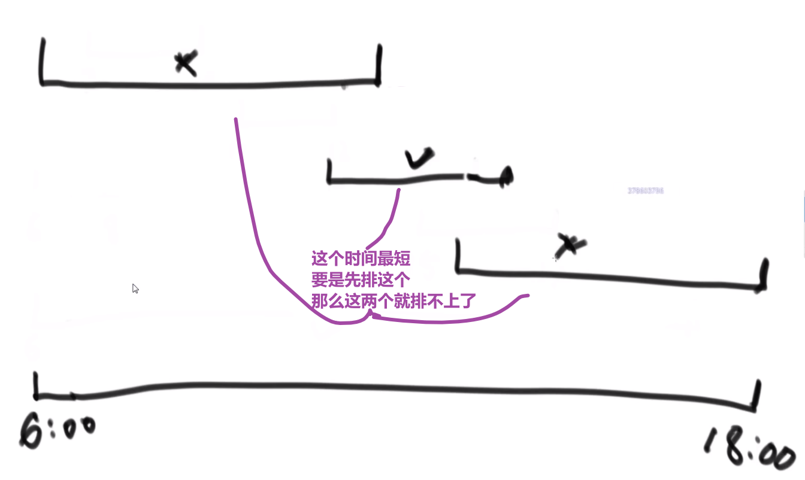

> 我们在这里正确的贪心的就是
>
> 哪一个项目的结束时间早，就先安排谁
>
> - 把当前所有项目哪个结束的最早先安排
> - 然后把所有因为我们安排了那个项目导致进行不了的项目删除掉
> - 接着把下一个结束最早的项目进行安排
>
> 等等等…


#### 贪心题目笔试中套路


> 多去想，如果想好一个贪心策略，尝试想出一个反例，想出一个就直接 pass 那个贪心策略，继续想别的贪心策略

#### 字典序例子


> 而且注意，贪心策略需要注意传递性，像 1<2,2<3 这种都是默认的传递性，而有的传递性就不一样了，需要想好贪心策略

这里的传递性 (transitivity):


> 然后各种证明…

------

#### 金条 (贪心) 问题–> 哈夫曼编码树


- 先把数都放进小根堆
- 接着取出最小的然后 (取完之后那个小根堆结构又形成) 再取那个时候最小的
- 然后我们拿着这俩相加，也就是当初那个树里面分割自己形成的这两个数，然后那个被分割代表的那个就是所要出的代价 (看下面图，有点难说)
- 把这个相加的结果记录到一共的代价里面，然后再把这个相加的结果放回小根堆因为为了形成他，当初可能分割了他和另外一个的数的和
- 重复直到最后只剩一个数，那个数肯定是 60 (in this case), 就一开始的长度

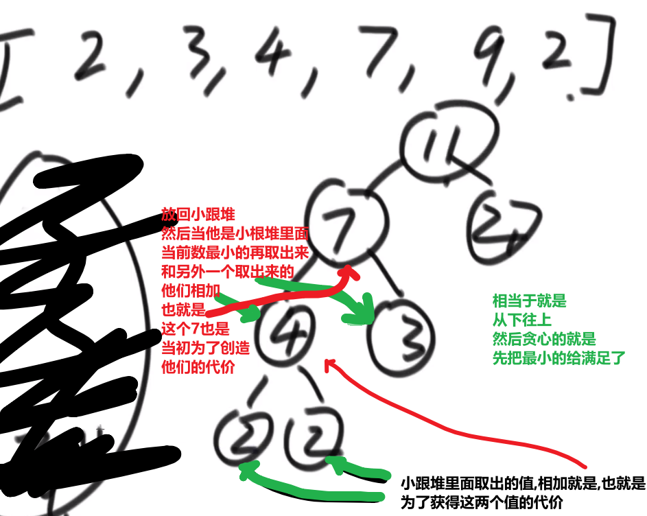

**这图只是过程中的一步，11 并不是一开始的长度，27 才是，后面的几步这里没画出来，可以看出来大概就是这么的步骤**

最后树的真正样子应该是


> 贪心策略中
>
> - 堆和排序是最常用的两个技巧

------

#### 项目利润


想法是:

- 先把所有的项目按照他们的花费放到小根堆里面去 (自己写比较器)
- **再从小根堆取出当前资金可以花费的所有的项目**
- 把那些项目放到一个按照项目利润的大根堆 (自己写比较器)
- 每次花费一个项目获得其利润都要更新当前资金值
- 如果遇到当前资金买不了任何小根堆里面的花费的 (从最低开始比) 也就代表大根堆里面没有元素了，或者已经交易了 k 次，那就直接返回当前资金

> 此处的贪心就是按照当前自己的资金可以买的所有的项目中挑选出利润最大的做，做完了更新资金，接着看当前资金可以买的所有的项目中挑选出利润最大的做，…


> 记住这种大根堆小根堆配合的！！！
>
> 这里是有两个可以排序的规则
>
> - 花费
> - 利润
>
> 然后就想一想对于每一个是用大根堆还是小根堆

------

#### 取得中位数


就是一个一个给你数，你如何很快地返回一个当前数中的中位数？

**答案：大根堆和小根堆！**

- 传进来一个数，我们先和大根堆堆顶比
  - 如果这个数更小，我们直接放到大根堆里面
  - 如果这个数更大，我们直接放到小根堆里面
- 然后接着就是检查当前大根堆和小根堆的 size 是不是大于等于 2
  - 是的话就需要把 size 更大的那个根堆的元素取出来放到另外一个根堆里面去
  - 不是的话就不用做什么
- 接着要还传了数，就接着处理

这样不管传了多少个数，较小的数都在大根堆里面，较大的数都在小根堆里面

> 因为各自维持了堆顶，中位数就很好获取到


> 然后就是看偶数还是奇数，偶数就是两个堆顶相加除 2, 奇数个就是 size 大的那个根堆的堆顶

很快，以为大根堆小根堆的调整水平都是 logN 水平的


## 12. 暴力递归


> 回溯就是在递归的基础之上在每一个步骤上进行标记和取消标记的处理

#### N 皇后


用递归去解决，在n行中，每一行的摆法数量都可以由  在本行所有列摆一遍+**<font color='red'>对应下面所有行的解法数量</font>**

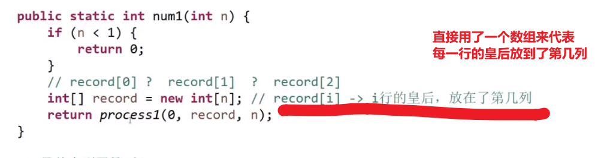


>  


斜线就是 dy/dx=1, 也就是 change in x = change in y

> 这个算法 ** 时间复杂度是 NN** 因为第一行 N 种选择，第二行 N 种选择，第 N 行 N 种选择 —>(NxNxNxNx…) 相乘 N 次

这个复杂度优化不了，但是我们可以做些常数优化:

**用位运算加速！**

… 比较复杂，暂时跳过

p11开头讲了迪杰斯特拉算法的优化，跳过，


#### 汉诺塔问题

解题思路：from: 圆盘所在位置；to: 圆盘要去的地方；help: 用于辅助

1. n-1 个圆盘从 from 到 help； (也就是左 -> 中，此时 help 就是右)
2. 第 n 个圆盘从 from 到 to； (也就是左 -> 右，此时 help 就是中)
3. 把那 n-1 个圆盘从 help 移动到 to 上面来。 (也就是中 -> 右，此时 help 就是左)

**注意递归中的base终止条件，其实就是当只剩这一个元素时，如何实现本递归主体的目的。这里就是把最上面的那个移到最右边就好了**


#### 打印一个字符串的全部子序列 (subsets)，包括空字符串

递归可以是大问题分成子问题，比如汉诺塔，也可以如这道题，解决问题的操作重复多步，每一步都是相同的思路，根据传参值不同进行处理。

- 区分子串和子序列： 给定 “pwwkew”
  1. 子串是 pww,wwk 等很多个子串 是连在一起的
  2. 子序列是 pwk,pke 等很多个子序列 ，但是子序列中的字符在字符串中不一定是连在一起的。


感觉这个有问题，它的顺序是打乱的。

```java
JAVApublic class Code_03_PrintSubString {

    public static void printSubStr(char[] chs,int i,String res){
        if(i == chs.length){
            System.out.println(res);
            return;
        }
        printSubStr(chs,i + 1,res);//不需要当前的字符的
        printSubStr(chs,i + 1,res + chs[i]);//需要当前的字符的
    }

    public static void main(String[] args) {
        String s = "abc";
        printSubStr(s.toCharArray(),0,"");
    }

}

//输出 
   (包含一个空字符串)
c
b
bc
a
ac
ab
abc
```

老师做法:

**递归中定义的临时变量都会被保存下来等待回溯**

两个，第一个省空间，不选这个点就将该点设“0”作为占位符。第一和第二思想一样，就是递归，<font color='orange'>重复对每个i位置的字符判断当前是否打印</font>，只有递归base就是到最后一个位置了打印出来，不打印是通过占位符实现的，其实还是把占位符打印出来了。

第二个方法也是重复对每个i位置的字符判断当前是否打印，不过传参的时候传入的是之前的res，对该res进行统一打印。


#### 打印一个字符串的全部子序列，要求不要出现重复字面值的子序列

输出前，加入 set 去重

#### 打印一个字符串的全部排列

举个栗子：

```java
字符不重复的情况下：
输入：abc
输出：abc acb bac bca cab cba

字符重复的情况下：
输入：acc
输出：acc acc cac cca cca cac
```

解题思路：把一个字符串看成由两部分组成：第一部分是它的第一个字符；第二部分是后面的所有字符。而我们求整个字符串的排列，可以看成两步。

求所有可能出现在第一个位置的字符，即把第一个字符和后面所有的字符交换。
固定第一个字符，求后面所有字符的排列。
**这时候我们仍把后面的所有字符分成两个部分：后面字符的第一个字符，以及这个字符之后的所有字符。然后把第一个字符和它后面的所有字符交换。（重复 1、2 步骤）**

**printAllPermutations2 为分治限界方法，可以减少递归次数**

```
JAVApublic class Code_04_Print_All_Permutations {

	public static void printAllPermutations1(String str) {
		char[] chs = str.toCharArray();
		process1(chs, 0);
	}

	public static void process1(char[] chs, int i) {//交换的是当前位置之后的元素
		if (i == chs.length) {
			System.out.println(String.valueOf(chs));
		}
        //如果i没有终止，i... 都可以来到位置
		for (int j = i; j < chs.length; j++) {//这个的理解是难点
			swap(chs, i, j);
			process1(chs, i + 1);
			swap(chs, i, j);
		}
	}

    // 在选择位置时就利用set ，减少递归次数，时间换空间
	public static void printAllPermutations2(String str) {
		char[] chs = str.toCharArray();
		process2(chs, 0);
	}
	public static void process2(char[] chs, int i) {
		if (i == chs.length) {
			System.out.println(String.valueOf(chs));
		}
		HashSet<Character> set = new HashSet<>();
		for (int j = i; j < chs.length; j++) {
			if (!set.contains(chs[j])) {
				set.add(chs[j]);
				swap(chs, i, j);
				process2(chs, i + 1);
				swap(chs, i, j);
			}
		}
	}

	public static void swap(char[] chs, int i, int j) {
		char tmp = chs[i];
		chs[i] = chs[j];
		chs[j] = tmp;
	}

	public static void main(String[] args) {
		String test1 = "abc";
		printAllPermutations1(test1);
		System.out.println("======");
		printAllPermutations2(test1);
		System.out.println("======");

		String test2 = "acc";
		printAllPermutations1(test2);
		System.out.println("======");
        printAllPermutations2(test1);
		System.out.println("======");
	}

}

[[1,2,3],
 [4,5,6],
 [7,8,9]
 ]
```

老师做法:


- 加上图中的注释就是去重的版本，根据26个英文字母建立数组，通过索引index实现。
- 那个 str 的 char array 相当于就是我们递归的每一层所做的选择


> 个人认为那个 for 循环才是秒
>
> - 首先一般你要考虑各种可能性 (然后这个可能性是指这第一个元素各种可能性，第二个元素也是各种可能性，so on…), 那么就可以考虑 for 循环第一个给他安排各种选择，然后递归调用自己的 (也就是对于他第二个元素等等), 然后那一层接着会调用下一层
> - 这样就做到了每一层接着都实现了各种可能性，当然要保证 base case 到达了之后我们做出我们对于每种可能性的结果做出合理的处理 (存起来？打印？返回上一层？等等等)
> - 我们还可以设置各种条件，比如说当前元素有没有已经存在等等等 (这个操作可能需要我们额外传一些参数，这样每一层都能知道当前状况) 如果有，也不要继续递归直接返回什么的，相当于把这个 branch 直接断掉了

#### 打印一个字符串的全部排列，要求不要出现重复的排列

- 举个栗子：

  > 输入：acc
  > 输出：acc cac cca

思路同上，加入了 HashSet 来去重。

```java
JAVApublic class PrintAllSort {
    public static void printAllSort(String string){
        if(string == null){
            return;
        }
        char[] chars = string.toCharArray();
        if(chars.length > 0){
            func2(0, chars);
        }
    }
 
    // 对i及i以后的字符进行全排序
    public static void func2(int i, char[] chars){
        if(i == chars.length){
            System.out.println(String.valueOf(chars));
        }
 
        // 用于保证每次交换的字符不存在重复字符
        HashSet<Character> set = new HashSet<>();
        for(int j = i; j < chars.length; j++){
            // 只有之前没有交换过这个字符才会交换
            if(!set.contains(chars[j])) {
                set.add(chars[j]);
                swap(i, j, chars);      // 第i个位置有i~n-1这些选择
                func2(i + 1, chars);  // 搞第i+1的位置
                swap(i, j, chars);
            }
        }
    }
 
    public static void swap(int i, int j, char[] chars){
        char temp = chars[i];
        chars[i] = chars[j];
        chars[j] = temp;
    }
 
    // 测试
    public static void main(String[] args) {
        printAllSort("acc");
    }
}
```

老师做法:


> 这种方式比拿到所有数据然后去重要快，因为这里直接如果不达标，那整条路都不用走 **(把不可能的路直接杀死)**, 就不需要拿到所有数据–> 这里就是分支限界–> 时间复杂度并没有减少，因为要是这个条件根本没有复合的那还不一样都是所有的 (branches) 数据，只是常数项有优化罢了

#### 纸牌游戏  返回获胜者分数


####  逆序栈

给一个栈，对其逆序，不能申请额外的数据结构，只能使用递归函数。

使用了两次递归，大递归的子 操作需要递归实现

f函数中result在递归中接受一个中间变量，对栈元素进**行保存**，等待回溯时候实施对应操作


> f函数：目的是把栈底的元素拿出来（栈中已经没有最底下的那个元素）  return last，这个last会一直从最深处的递归一直传递保存到最上面递归结束
>
> 这个f递归并<font color='orange'>不是</font>为了完成某个目的然后分成很多子目的 的递归，而是为用递归的形式保存一个值（<font color='red'>last = f(stack)</font> )，逐渐递归从最底层到最上层 （每一层的递归的返回值都是栈底元素）
>
> 每一次递归都会先把当前的栈顶pop出来，在最后一个栈元素时pop发现栈空，那么当前元素就是目标元素，返回，上一层递归（倒数第二个元素）就会调用<font color='red'>last = f(stack)</font>   

> reverse就是完成目的然后分子目的的递归


#### 数字与字符串对应

是和26个英文字母相对应的（不是纸牌）

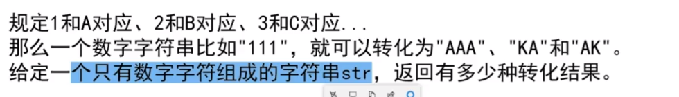

> 还是从左到右试， **从左到右试时很经典的方法！**

我们要这么想 (即使是假设)

- 首先就想 0 到 i-1 位置的元素都已经处理好了
- 我们只关心 i 到 nums.length-1 就行

如果我们这个当前 i 位置的是

- 0 的话，0 没有任何对应的，所以应该是跟之前的已经定好的搁一块决定的，我们直接返回 0

> 0 字符的话后面怎么转都没有效，因为我们没有 0 对应的字符也没有 0 开头的数字对应的字符


- 不是 0 的话
  - 我们可以让那个元素直接变成对应的字符，然后处理 i+1 到 nums.length-1 就行
  - 我们也可以看这个字符是 1,2 还是 3-9
    - 如果是 3-9, 我们不可以让他跟 i+1 位置的字符结合，因为我们不能有 3 (以及) 开头的数字，(最高也只是 26 个字符，按照题目), 所以我们只能让他自己这个数字直接换，不要想什么跟 i-1 的位置结合，i-1 的位置是定的！对于我们当前层来说，i-1 那层他自己 (只要我们递归的逻辑做对) 自然会按照我们的逻辑试出他所可以的可能性的
    - 如果是 1, 我们总可以让他跟 i+1 位置的数字结合，然后只处理 i+2 以及以后的 (因为开头是 1 的话，个位数任何树都可以有对应的字符)
    - 如果是 2, 我们就可以看他跟 i+1 位置的数字结合有没有超过 26, 超过了我们就不可以，没超过我们就可以结合，然后只处理 i+2 以及以后的

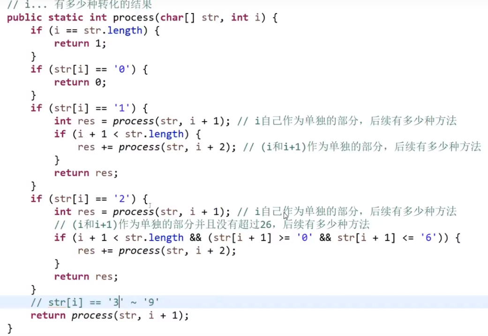

------

#### 物体重量和价值


> 思想就是，我们暴力递归
>
> - 取不加当前重量和加当前重量的最大值
>   - 如果不加当前重量，就接着取不加下一个重量和加的重量的最大值
>   - 如果加当前重量，就接着取不加下一个重量和加的重量的最大值
> - 反正我们 return 那里有 Math.max 确保我们每一层返回的都是最大可能性，然后这个是暴力递归 (除了一开始的 if statement 检测当前有没有已经超过了重量，相当于是分支限界) 确保了我们考虑到了每一个合法的可能性然后把最大的一层一层的返回出去了.

> 暴力递归尽量选
>
> - 可变的参数为少的 
> - 可变的参数形式最简单 (一个值，不要链表什么的，除非必须要)

------

##  13. 哈希函数

- 输入可以是无穷大，输出是有限范围内
- 同样的输入，同样的输出
- 不同输入可能会有同样的输出–> 毕竟无限输入然后输出是有限的
- 均匀的，离散的，分散在哈希表


如果想要一张哈希表存大量的数据，放到内存里面，那么如果数据不一样的话，哈希表占用很大的，我们希望数据是有很多是重的，这样多个只不过是对于那个重复的元素的 value <font color='orange'>改变改的更大</font>而不是不同数据的那样让很多位置都占满

- 这样我们可以把那些一堆数据 apply 哈希函数，让他们均匀的分散的在哈希表
- 然后再对哈希函数取模 (比如说 100), 再把对应数据存到对应取模后的位置
- 那么这样我们最多也就是 0-99 个 key, 而且因为哈希函数保证能差不多均匀的分散来–> 相当于是把数据都分散到 100 个**文件上 (存到硬盘)**
- 那么我们取模后所有数据也都是均匀的分散开来
- 而我们需要某一个数据处理的时候，我们只需要获取一个 key 对应的值，然后只对那个放内存做处理，这样就做到了不用整张表一大堆 key 都放到内存，可能会让内存爆掉如果内存空间不足
- 我们哈希表每一个对应的下标位置可以存的也是哈希表，只不过这个是更小数据，内存不会爆
- 如果想要处理多个下标的数据，我们可以一个一个来，先把第一个放到内存里面处理，接着第二个，… 所以内存是不会爆的

如果有一个下标的链表长度超过一个数 (说明其他也都差不多，均匀分散开来), 那么就会扩容

比如说直接扩容成两倍，那么每一个数就接着哈希函数均匀的分散在新的扩容后的哈希表里

- 就比如说想找一个东西，那么会先哈希值 (O (1)), 然后模一个值 (O (1))
- 找到了下标就会去那个下表的链表找，如果链表长度为 k, 那么就会是 O (k)
- 如果链表不是特边长，那么查删改一个数据都是 O (1), 因为 k 接近于常数

扩容代价:

- 如果加了 n 个数据，就会最多最多 (也就是每次翻倍都会扩容) 经历 log (n) 次扩容（每次都是扩容一倍，2^n=N），实际扩容次数远远少于 log (n) 不过只是常数减少，还是这个级别
- 每次扩容都需要 O (n) 的代价 (n个数重新算哈希值，取模，然后挨个放到对应的位置去)
- 总扩容代价就是 O (NlogN), 这是对于加了 n 个数据的扩容的代价

我们除以 n 就可以得出， **<font color='orange'>单次</font>查询，删除，更改一个数据的平均代价就是 O (logn) 的级别**

> 这个 O (logn) 会是小常数，如果链表不要太长

java 虚拟机可以帮助我们做哈希离线技术

**就是我们一个哈希表做扩容不占用用户用哈希表的在线时间的**

实际上哈希表用起来无比接近于 O (1)

> **但是理论就是 O (logn)**

#### 设计一个数据结构 


- 两个 map
  - 一个是数据 key,index 作为 value ： map (key:index)
  - 一个是数据 value,index 作为 key :   map(index:value)
- 一个记录 size, 一开始是 0

我们只需要随机生产 0-size-1 的值，就可以等概率获得一个数字，然后用 map 取就行了

对于删除操作，我们可以先通过那个 key 在 map 里面找到对应的 index, 然后更新那个 index 到那个被删除的数据的 index, 然后更新 size

为了一直连续，需要每次都将map1中最后一个元素的key值移动到当前被删的这个key，填补空白，更新map2


> 使用一个或多个哈希表，可以做到很多操作变成 O (1) 操作！实际上来说 (虽然哈希表是 log (N) 的操作，但是之前提到的技术可以做到实际就是 O (1) 的)

## 14. 岛问题和并查集

#### 岛问题


- 遍历如果遇到一个 1, 就把当前位置给到一个 infect 函数
- 这个函数就会把这个位置以及周围是 1 的全部变成 2
- 此时我们就可以让 ans++, 说明找到一个岛
- 然后我们继续遍历，如果遇到是 2 就继续找，只有是 1 的时候我们才把当前位置传给 infect
- so on…


> 这里infect用到了递归，对当前(i,j)位置要进行上下左右方向的影响，
>
> 不用if判断上下左右的原因不是麻烦，而是要一直传递蔓延，if只能判断当前的上下左右，
>
> 直接用递归，一直蔓延，目的一致的操作用递归。

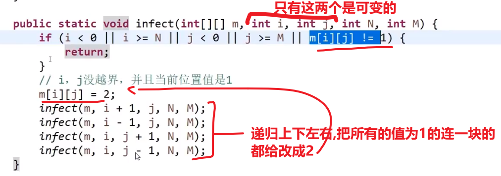

> **这整个的时间复杂度是 O (n\*m),n 代表 number of rows, m 代表 number of columns (就是主函数里面那个 nested for loop)**
>
> 外面那个 nested for loop 会碰每一个元素一次
>
> 虽然 infect 是递归但其实并不高，每一个位置的元素只能被他的上下左右触及到，所以每一个位置的元素在 infect 阶段最多最多调用四次，所以整个 infect 每个元素都是被调用有限几次。不要想一个位置调用谁，而是想一个位置被谁调用了
>
> 那个还是外面那个 nested for loop 最耗时间

**并行算法解决这个问题:**

> 注意 acm, 面试，一般都是单 cpu, 单进程的题目
>
> 但是也有可能是并行触发的题目–> 并发集

------

#### 并查集

一个支持集合合并非常快速的结构

有两个操作:

1. 检查两个集合是不是同一个集合
2. 把两个集合变成一个集合

用我们经典的数据结构，无法做到两个操作都是 O (1), 反正至少一个得要比遍历

**我们并查集就可以在 O (1) 时间复杂度实现这两个操作**

并查集的重要思想在于，**用集合中的一个元素代表集合**。我曾看过一个有趣的比喻，把集合比喻成**帮派**，而代表元素则是**帮主**。接下来我们利用这个比喻，看看并查集是如何运作的。


最开始，所有大侠各自为战。他们各自的帮主自然就是自己。*（对于只有一个元素的集合，代表元素自然是唯一的那个元素）*

现在 1 号和 3 号比武，假设 1 号赢了（这里具体谁赢暂时不重要），那么 3 号就认 1 号作帮主 *（合并 1 号和 3 号所在的集合，1 号为代表元素）*。


现在 2 号想和 3 号比武 *（合并 3 号和 2 号所在的集合）*，但 3 号表示，别跟我打，让我帮主来收拾你*（合并代表元素）*。不妨设这次又是 1 号赢了，那么 2 号也认 1 号做帮主。


现在我们假设 4、5、6 号也进行了一番帮派合并，江湖局势变成下面这样：


现在假设 2 号想与 6 号比，跟刚刚说的一样，喊帮主 1 号和 4 号出来打一架（帮主真辛苦啊）。1 号胜利后，4 号认 1 号为帮主，当然他的手下也都是跟着投降了。


好了，比喻结束了。如果你有一点图论基础，相信你已经觉察到，这是一个**树**状的结构，要寻找集合的代表元素，只需要一层一层往上访问**父节点**（图中箭头所指的圆），直达树的**根节点**（图中橙色的圆）即可。根节点的父节点是它自己。我们可以直接把它画成一棵树：

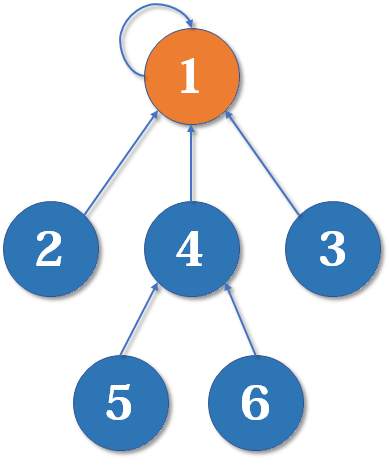

##### 路径压缩

最简单的并查集效率是比较低的。例如，来看下面这个场景：


现在我们要 merge (2,3)，于是从 2 找到 1，fa [1]=3，于是变成了这样：


然后我们又找来一个元素 4，并需要执行 merge (2,4)：


从 2 找到 1，再找到 3，然后 fa [3]=4，于是变成了这样：


大家应该有感觉了，这样可能会形成一条长长的**链**，随着链越来越长，我们想要从底部找到根节点会变得越来越难。

怎么解决呢？我们可以使用**路径压缩**的方法。既然我们只关心一个元素对应的**根节点**，那我们希望每个元素到根节点的路径尽可能短，最好只需要一步，像这样：


> 其实这说来也很好实现。只要我们在查询的过程中，**把沿途的每个节点的父节点都设为根节点**即可。下一次再查询时，我们就可以省很多事。


这个就代表我们那个圈，就是不管什么类型进来我们就先让变成一个集合 (像是), 相当于给他包装一层就是这个 element 类


> 并查集使用的前提就是初始化的时候把所有数据给我们了，这样我们才可以挨个包装成 Element 然后你接着可以做检查是不是同一集合，以及把两个不是同一个集合的合并成一个集合这种操作。注意这里面数据只是针对于你一开始初始化的，不能使用别的数据


> 所以我们只需要调用并查集的构造函数把所有数据传进去
>
> **之后我们就可以对这些数据调用 isSameSet 和 Union 方法，然后时间复杂度很低 O (1)**
>
> 尽管这两个方法都调用了 findHead 方法， **其实只要方法被调用够多次数 (O (n) 次)(他内部那个扁平化优化), 其实调用他的时间复杂度是非常非常接近于 O (1)**—>(他的证明很难很难，花了 20 多年才证明出来)

------

#### 使用并查集解决岛问题

比如说岛问题给的二维数组特别特别大，那么我们之前那种方法只用一个 CPU 就会非常非常耗时间

首先，使用两个 CPU:


其实我们整个来看就一个岛，但是

- 处理左边的 CPU 找到两个岛
- 处理右边的 CPU 也会找到两个岛

这是不对的，所以我们两个 CPU 需要想一个合并逻辑去求出一个正确的岛的数量

我们合并逻辑

- 首先记录我们从哪个点开始感染每一块岛
- 对于每个感染到的在边缘 (**分割的边缘**), 我们给他们做个记号 (记号就是我们开始感染的那个点)

比如说处理我们左边的 CPU 的数据


右边同理:


做合并:

一开始有多少 (从哪开始的) 感染点–> 四个，ABCD, 所以相当于传进去给并查集的构造函数形成四个集合

然后左边右边 CPU 分割算出 2 个岛，也就是一共 4 个岛

- **我们对于 (分割的) 边缘那块连在一起的集合 (如果他们不是同一个集合) 让他们连在一起**，然后让总共岛数 - 1


此时集合是 {A,C} {B}

- 接着看，此时 B 所在的岛和 C 所在的岛 **(他们代表的集合不是同一个，而且还在边缘除相连接，所以就合并！)** 合并在一起，总数 - 1

此时集合是 {A,C,B}

- 同理 B 和 D 代表的集合不是同一个，而且还在边缘除相连接，所以就合并，总数 - 1

此时集合是

- 然后 A 和 D 检查，现在是一同一个集合了！！！所以不用 - 1 (而且因为之后也没有其他集合要检查了，如果有的话就继续看然后合并等等等), 也就是现在岛数就是 1, 也就是正确答案

> 这样就做到了两个 CPU 分别处理一半，然后最后合并等等操作还是正确答案，当然比一个 CPU 处理整块快

多个 CPU:


> **同理，分成好多块，然后让每一个 CPU 收集四边 (四边都要！) 的信息，然后就可以之后合并就跟四边都要合并一下**，最后合并成一大块，速度当然非常快

------

## 15. KMP


**暴力解法的时间复杂度是 O (n\*m)–>n 是 str1 的长度，m 是 str2 的长度**

我们需要遍历 str1 然后每一个开头我们都可能要检查接下来的 m 字符看对不对，如果不对要接着 str1 下一个字符看 (不可以直接跳！) 接下来的 m 字符看对不对

**KMP**


图中指前缀和后缀

不要取到整的是因为取到整到的话，自己当然跟自己一样，所以没有意义

**所以 k 这个字符存什么信息？存对于他之前那些字符比较，最大的且前后缀一样的那个才是，这里就是 3**

对于 **str2 (不是对于较长的 str1 求的！！)** 每一个字符，我们都需要这样的信息


> 注意对于   （意义就是当前位置前面的字符的k值，不包含当前位置元素）
>
> - 第一个字符，因为前面压根没有任何字符，我们直接就是 **-1**
> - 第二个字符之前就一个字符，其实怎么样都会是 **0**
> - 其他就正常的像我上面说的求
>
> 这个 next 数组，就代表我们知道 str2 这个字符串中，任何一个字符**他前面的字符串最长的前缀和后缀的长度**，我都知道

我们可以拿和这个 next 数组做到 KMP 加速，解决问题

列子:


- 如果是经典暴力做法：我们发现这个不一样，我们就会 **str1 中 X 的位置回跳到 i+1 位置**以及 **str2 中 Y 的位置回跳到 0 位置**，继续开始比
- 如果是 KMP 做法：当我们第一次发现 str1 和 str2 有一个字符不一样 (X 和 Y), 我们就知道 str2 中对于这个 Y 字符他前面的字符串最长的前缀和后缀的长度，比如说这一块 (他们当然可以相交，就是错过去，这里只是为了好看理解就放了那么两端的前缀和后缀):


我们让 str1 中不要回跳到 i+1 位置，还是待在 X 的位置

我们让 str2 中会跳到这个位置:


**然后让当前 str2 中新的这个位置和 str1 的 X 的位置相比，看看是不是同一个字符**

这个相当于是把前缀位置给推倒后缀相同的部分的位置上去


> 原来我们是检查 i 开头能不能配出 str2, 现在我们这么做了后，相当于是检查 j 开头的能不能配出 str2, 我们只让可能不同的位置往下验
>
> 
>
> 这么做，我们就可以
>
> - 不用让 str1 回到 i+1 位置 (也有可能回到，具体看 str2 的那个 next 数组), 而是像图里面一样直接让从 x 位置重新比，只不过这次要是找到了，那么返回的开始 index 是 j 而不是 i, 相当于此时是从 j 比的，但我们并没有真正从 j 然后 j+1,… 开始比的，而是直接跳过了直接比 x 因为我们知道 j,j+1,…,x-1 位置上的元素一定跟我们的 str2 的 u,u+1,…,y-1 位置的元素一样，我们才会比到 X 和 Y 位置，我们还知道 u,u+1,…,y-1 这一块，按照我们 Y 字符对应的 next 数组的下标的位置知道对应的前缀是哪一块，也就是 v,v+1,…,k-1, 所以 j,j+1,…,x-1==v,v+1,…,k-1, 这一块是两个 str 都一样的，我们接着只需要比较 str1 的 x 的位置和 str2 的 k 位置的元素是不是同一个就行了 **(前面我们已经确定是一样的了)**, 如果是同一个，那么如果 str1 如果还有元素，就会跟 str2 接下来的 (k+1,k+2,…) 的元素比，如果没有的话，那就不对了，我们这个 str2 当前还没比的元素明显还有，所以就返回没有找到。我们还知道 i 位置到 j-1 位置一定 (作为开头) 配不出 str2, 所以我们把检查位置直接挪到 j 位置.
> - 我们也不需要让 str2 回到 0 (v) 位置继续比，我们直接回到 k 位置就行了，道理上面都说了
>
> 相当于两个字符串回去的程度都没暴力方式的那么多罢了，道理还是一样的，一个一个比等等等

具体例子:


暴力解法：发现最后那一个不一样，会接着从 i+1 也就是 b 开始比 (跟 str 的 0 位置也就是 a) 看看一不一样，发现第一个就不一样，接着就是 i+2…

KMP:


相当于我们把 str2 给往右挪了:


如果这么假设，那就代表:


可以看出，我们这里岂不是找出了一个对于 y 字符他当前 next 对应下标存的值还要大的值–> 就是比我们之前看 str2 算 next 数组，出现了更大的对于 y 字符前面的字符串来说前缀和后缀相等的情况–> 这不可能，因为我们 next 存的就是最大最大的对于 y 字符前面的字符串来说前缀和后缀相等的长度，所以我们的假设是不对的，证明 i 到 j-1 位置会有开头然后会匹配 str2 的情况是不可能发生的

> **所以我们可以直接从 i 位置跳到 j 位置，不用担心中间的字符会有开头然后会匹配 str2 的情况发生 (因为压根不会发生！)**


时间复杂度:


> 这两个变量在我们的 while 循环里面，最大幅度就是 2N, 所以那个 while 循环时间复杂度就是 O (N)

**找 next 数组:**

- 第一个默认是 - 1

- 第二个默认是 0

- 之后每一个 i 位置都要靠前面的 i-1 位置的元素得出

- 对于 i 位置来说，如果 next 数组的 i-1 位置是 x, 那么你需要在 str2 里面的 x 位置的元素跟 i-1 位置的元素比较

  - 如果一样，那么 next 数组中，**i 位置的元素是 x+1**

  

  > 必须是 x+1, 可以反证如果不是的话，那么 next 数组中 i-1 位置的元素就不会是 x 了

  - 如果不一样，比如说 next 数组中 x 位置存的是 y, 那么现在就去 str2 里面拿 y 位置的字符跟 i-1 位置字符比

    

    - 如果一样，那么 next 数组中，**i 位置的元素是 y+1**
    - 如果不一样，继续跳…

    直到最后跳到 next 数组的 0 位置比较

    -> 如果一样那么，i 位置的元素是 1

    -> 如果不一样，就是 0

    

    这个的时间复杂度:

    

    > 跟之前 KMP 主方法一样的，都是线性的，也就是 O (M) 时间复杂度

整个复杂度:

我们知道获取 next 数组是 O (M) 的–>M 是 str2 的长度

我们知道 KMP 主方法是 O (N) 的–>N 是 str1 的长度

**我们还知道 str1 是至少要比 str2 长的**， 所以整个 KMP 算法就是 O (N).


## 16. Manacher 算法

> 解决字符串最长的回文子串的问题，以及很多…


一般解法:

- 每个字符作为中心轴，像左右两边阔，看看是不是回文


但是这种方法，可能会因为长度为偶数，而错过某个回文，比如说:


解决方法，加一个 #到最前面和最后面，然后每两个字符之间加一个#


**然后再对每一个字符做出这种操作，就可以获得每个字符左右的回文包括 #的，然后我们需要 / 2 就可以获得对于每一个字符正确的回文长度 (相当于除 2 是把所有 #给清掉了)**

> **其实加的特殊字符是什么都行，就算是原本数组里面有这个字符也没事，不会影响最后答案的！**


> 经典做法的时间复杂度就是 O (N2), 因为比如说:


不管是哪个元素都会扩到两边头，然后又有 n 个元素，所以就是 O (N2)

**Manacher 也是差不多想法，但是做了加速，导致时间复杂度为 O (N)**

- 首先有个 R 变量，一开始是 - 1, 在我们看每一个字符的回文的时候，记录当前最大的右边界的值

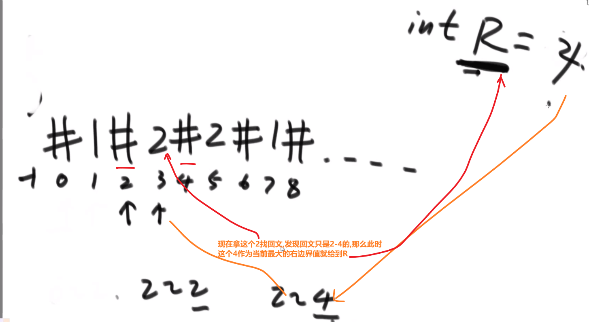

- 然后有个 C 变量，一开始是 - 1, 在我们看每一个字符的回文的时候，找到的就是对于那个字符找到的那个回文的中心位置，这个 C 也是只存最右的中心位置（就是每次取R的时候，当前R的对应回文中心的位置，RC是伴生的，R变C必然变）


…(看下方！)

#### 原始问题

Manacher 算法是由题目 “求字符串中最长回文子串的长度” 而来。比如 abcdcb 的最长回文子串为 bcdcb，其长度为 5。

我们可以遍历字符串中的每个字符，当遍历到某个字符时就比较一下其左边相邻的字符和其右边相邻的字符是否相同，如果相同则继续比较其右边的右边和其左边的左边是否相同，如果相同则继续比较……，我们暂且称这个过程为**向外 “扩”**。当 “扩” 不动时，经过的所有字符组成的子串就是以当前遍历字符为中心的最长回文子串。

我们每次遍历都能得到一个最长回文子串的长度，使用一个全局变量保存最大的那个，遍历完后就能得到此题的解。但分析这种方法的时间复杂度：当来到第一个字符时，只能扩其本身即 1 个；来到第二个字符时，最多扩两个；……；来到字符串中间那个字符时，最多扩 (n-1)/2+1 个；因此时间复杂度为 1+2+……+(n-1)/2+1 即 O (N^2)。但 Manacher 算法却能做到 O (N)。

注意：在找回文的过程中，一般要在每个字符中间插入 #之类的间隔符，来避免奇数和偶数的差别回文

#### 补充概念：

回文直径：以一个位置为中心，扩出来整个串的长度为回文直径
回文半径：以一个位置为中心，扩出来半个串长度为回文半径
回文数组：对于字符串而言，从 0 位置开始，一直到最后，新建一个数组，数组中保存对应位置的回文半径。
最右回文右边界R：所有回文半径中，最靠右的边界，回文右边界只要没更新，记录最早取得此处的回文中心。遍历每个元素都会更新一遍R（如果R更改了

Manacher 在向外扩展的过程整体跟之前的算法相似，但是有加速。

#### 【步骤】

1. **回文右边界 R 不包含位置 i，此时暴力扩展，直到 R 包含 i。**(因为要遍历字符串，然后当前遍历的位置索引> R 当时的值，就是不包含，只能暴力扩展)
2. i 位置在回文有边界内时 (当前位置 <=R 当时的值)，知道了回文右边界可以知道回文左边界，对称中心为 c，此时关于 c 做 i 的对称点 i‘

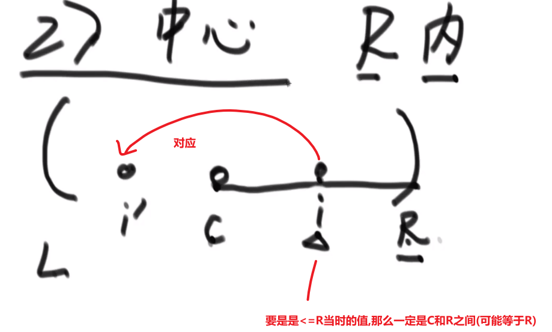

- 若 i‘的回文彻底在 c 为中心的回文里面（在之前的步骤里，i‘的回文已经搜过了），**此时 i 的回文半径和 i’的回文半径相同 (所以全径也相同)**


> 注意正常来讲中间都是加特殊字符的只是这里为了方便而没有那么做

- i 位置的对称位置 i’的回文半径越过了以 c 为中心的左边范围。（i‘扩出的范围以 c 为中心的回文没包住，存在一部分在回文直径外面）此时 i 的回文半径是 R-i (所以全径就是 2\* (R-i) 长度)


> 注意正常来讲中间都是加特殊字符的只是这里为了方便而没有那么做

- 正好 i‘的回文半径正好跟左边 L 相等，此时可以知道 i 的回文半径大于等于 R-i (**其实 this case 就是 i’的半径**)，然后需要判断 R 后面的位置，重新返回第一步 (**因为不确定 i 的回文有没有可能更远**)。


> 注意正常来讲中间都是加特殊字符的只是这里为了方便而没有那么做

整个算法的复杂度 O (n)，虽然第一步和第 2 步的第三点花费时间长，但是第一步和第 2 步的第三点都会扩展 R，依次变化的过程中，**R 最多也就是变化到 n，所以时间复杂度为 O (n)**

伪代码:

> 下方代码是为了:
>
> - 让传进来的字符串或者字符数组变成那种包含特殊字符的字符数组 str
> - 然后定义新的 int 数组用来装 str 的每一个字符的回文半径
> - 定义 C,R 变量 (之前说过)
> - 然后就是我们上面的说的，看在不在范围内，不在就暴力扩，在就看左边界有没有超过，有没有压着 L 等等等。让那个存 str 的每一个字符的回文半径的数组填满
> - 期间注意更新 R 值和 C 值


#### 实际代码


> 注意那个一开始获取对于 i 最小需要扩的位置的代码可以看视频 https://www.bilibili.com/video/BV13g41157hK?p=13, 第 1:26:30 部分，说的很清晰，基本上就是考虑了我们上面所说的所有情况然后取了最小的

> 这里的代码主要是为了短，想法跟我们上面所说的其实有些区别，不过主要想法是一样的，只不过没有像我们说的按照不同情况各种 if else 等等等

> **这里我们的那个 str 处理串的回文半径长度能帮我门解决很多问题，而找出一个字符或者字符数组的最长的回文子串 (的长度) 只是其中的一个问题**

------

## 17. 滑动窗口


> 有两个原则
>
> - L 和 R 只能往右走
> - L 不能比 R 还右
>
> R++ 代表把一个元素加进窗口
>
> L++ 代表把一个元素移出窗口

而上面那个题需要我们每次窗口更新都获取最大值，我们可以遍历这也可以，但是效率低，我们可以更新一下结构让用户快速获取最大值，效率会很快

- 首先有一个双向的队列 (也就是两端都可以取值), 这个队列用来存下标的 (**为什么不存元素？因为存下标可以通过数组快速地获取到对应的值，存下标还可以给我们更多的信息**)

- 我们这个双向的队列**从头到尾**要保证是每一次窗口的值**由大变小**的**排他们的下标**，<font color='orange'>窗口的最大值一定在双端队列的头部位置</font>

- 当我们 R++, 尝试把这个新加的元素从队列尾部开始加

  - 如果这个新加的元素值比我们的队列尾部那个元素要小，直接让这个新加的元素的下标加入到尾部

  - 如果这个新加的元素值比我们的队列尾部那个元素**要大或者等于**，把那个尾部的元素弹出，然后比较下一个，一直比到为空或者遇到比新加的元素值大的元素，我们才让这个新加的元素的下标加入到尾部

    
    
    > 这些被弹出的元素再也不可能成为此时以及以后的窗口的最大值了，因为我们这个新加的元素下标目前是最右的 (记得 L 和 R 只会往右走) 所以最晚过期，且新加的元素值又比那些值要大，那么肯定当前或者之后的窗口要是有这个元素肯定会比过我们当前弹出的元素 (等于或者小于这个新加的元素的值), 所以我们这些值其实不需要了，直接弹出就好了

  此时我们的队列的头保留的就是我们每一次窗口的最大值

- 当我们 L++, 说明想要把一个元素移出我们当前这个窗口，我们检查这个移出元素的下标

  - 如果这个下标跟我们当前双向队列的头位置存的下标一样，直接让头弹出
  - 如果这个下标跟我们当前双向队列的头位置存的下标不一样， **不需要管**

> 这个双向队列存的信息就是
>
> **"如果目前的窗口不再扩 (R 不 ++), 且我们选择让 L++ 也就是移出一个个元素，谁会依次成为最大值的这个优先级顺序的信息"**

> **这个双向队列的总代价 (时间复杂度) 是 O (N)**, 因为你这个滑动窗口往右走的时候，走过 N 个元素，我们双向队列最多让 N 个元素弹出，最多让 N 个元素加入，所以代价就是 O (N) 级别，这个是对于 N 个元素.
>
> **如果是单个元素，那么每一个元素的平均代价就是 O (N)/N = O(1)**

注意上面说的是并不代表每一个元素就是 O (1), 而是平均下来每一个是 O (1), 看下方例子就明白了


#### 解决问题

- 只要每次让 L 和 R 让窗口保持大小为 w 就解决了
- 其他的和我们所说的都差不多


> 上面是最大值，最小值同理，都是反过来就行了

------

## 18. 单调栈

找到他最近的比他大的位置


例子:


- 有一个栈，因为我们关心的是**更大**，所以**栈底到栈顶是从大到小**的顺序，这个栈是用来存下标的 (**为什么不存元素？因为存下标可以通过数组快速地获取到对应的值，存下标还可以给我们更多的信息**)

- 遍历，如果这个元素

  - 比我们栈顶的小，直接把下标放进去

  - 比我们栈顶的大，把那个栈顶的元素弹出。注意！只要一个元素要弹出，他的信息就开始生成

    - **他的左边最近比他大的就是他弹出的时候的栈底 (原本压被他压在下面的下标的元素), 如果本身就是栈底了，弹出之后没有元素了，那么说明左边最近比他大的元素为 null**
    - **他的右边最近比他大的就是此时我们要新加的元素，如果没有新加的元素 (到头了，但是栈里面还有元素) 那么就说明右边最近比他大的元素为 null**

    然后比较下一个，一直比到为空或者遇到比新加的元素值大的元素，我们才让这个新加的元素的下标加入到栈顶，或者遇到一样的直接让他们存在一个集合里面去

  - **跟我们栈顶存的下标对应的元素一样，把下标压在一起，可以用集合，然后之后这个位置的存下标的集合弹出了，就会把里面所有的下标对应的元素都生成信息 (对于每一个下标对应的元素信息按照上面说的都一样的)**

    注意！！！如果一个集合多个下标元素，我们想要用它信息的时候用的是当前集合**最后**一个元素存的下标

    

> 这个跟上面的滑动窗口的双向队列的一样，时间复杂度是 O (N)**, 因为你这往右走的时候，走过 N 个元素，我们单调栈最多让 N 个元素弹出，最多让 N 个元素加入，所以代价就是 O (N) 级别，这个是对于 N 个元素.**
>
> **如果是单个元素，那么每一个元素的平均代价就是 O (N)/N = O(1)**

题目:


解法:  遍历对每个数进行分析，必须保证子数组的最小值就是其自身，这样累计和与最小值乘积才会最大

- 其实就是单调栈
- 看每个元素左边最近比自己小的，右边最近比自己小的，然后只扩到不包含那里 (这就保证了我们每一个元素只扩到比自己大的元素，最后形成的子数组就是最大指标累加是最大的)

##  19. 大数据

#### 布隆过滤器

比如说你想存 100 亿 url 都是黑名单 (**其实这个跟爬虫去重问题一样**), 每个 url64bytes

**我们只需要加 url 以及查一个 url 存不存在这两个功能，且这个需要在内存，因为要是查硬盘存的那就时间太长了**

如果要存到一个哈希表那就需要 6400 亿 bytes, 内存根本塞不下

所以我们可以使用布隆过滤器–>

> 布隆过滤器也是放在内存里面，使用空间很少
>
> **还有就是允许一定程度的失误率 (就是一个 url 在黑名单没查出来 (布隆过滤器不会有这种失误), 或者一个 url 不在黑名单结果查出是在黑名单里面 (布隆过滤器会有这种失误))**

首先，bit 数组，就是每个元素就是一个比特，如何声明？


这里就是声明了一个长度为 320 比特的数组


现在想拿出下标为 178 的比特


这个 bit 是 1, 那么 s 就是 1, 如果这个 bit 是 0, 那么 s 就是 0

​	1<<(bitindex)操作的意思是生成只有bitIndex位上那个数为1，其他皆为0的一串数字，然后就可以通过与或运算对这个arr[numIndex]元素针对bitIndex位进行操作。，


布隆过滤器就是一个超大的 bit 数组，假设 0-m-1, 那么总共就 m 个 bit, 也就是 m/8 个字节，很省空间

对于我们这个列子，对于每一个 url 我们对他**调用多个哈希函数**获得**多个位置**，接着就把 bit 数组对应的下标的值改黑 (0 变成 1or vice versa).

这样子之后想查一个数据，就会按照哈希函数找到所有对应的下标然后去看到底是不是全是被改成黑的，如果全是那么说明就是个黑名单的 url, 如果有起码一个没标成黑的，说明这个 url 不属于黑名单.

> 如果有一个 url 是黑名单 (之前已经加过了), 那就说明再查就一定全是黑的，所以这个错误不会发生
>
> 所以可能误判的问题就明显了，一个 url 经过多个哈希函数得到的下标，恰恰好就被之前其他多个 url 把那改为黑的，那么这个可能一看正好获得全是黑的，那么就会认为这个 url 也属于黑名单，其实并不

> **m–> 到底多大由你决定，越大失误率更小**
>
> **k 个哈希函数–> 到底几个由你决定，这个要靠 m 的大小，并不是越多越好，越多一个 url 也会涂更多，所以还是要按照 m 的大小定一个合适的 k 最好**

**什么时候使用过滤器**

- 在内存
- 是不是我们上面说的类似的结构–> 只是查询添加，没有删除的这种
- 允许一定失误率 (本来不在那上面的，结果返回结果还是在上面)

> 注意！ 布隆过滤器只和 m 和 k 参数有关，单样本的大小随便，任何大的都行！ 我们都会对他使用哈希函数等等等！！！ **只要那个哈希函数可以接收那个数据的长度就可以**！！！
>
> == 单样本多大跟我们的布隆过滤器设计多大，设置多少个哈希函数，一点都没关系，只需要保证<font color='orange'>那个哈希函数可以接收那个长度的数据就可以</font>了！！！==

**三个公式:**


然后这个 m 是 bits 的个数，我们 ÷8 可以得出多少个 bytes

对于 100 个 url 的例子，我们这里就是 26g (compared to 640g needed by hashset structrue), 内存不会被撑爆


> 如果有任何小数， **都向上取整** (比如说 m, 以及算出来的 k 等等等)

上面算出的 m 是理论的 (预期的), 如果面试官跟我们说可以更大，那么实际给的大小就是 m 真

然后 k 值按照那个 m 真算出的就叫做 k 真

我们可以用 m 真和 k 真算出实际的失误率 (肯定比我们的预期的失误率还低)


> **有了这个三个公式，我们只需要 n 的大小，以及允许多少失误率，就可以算出 m 和 k**, 有了 m 我们就能知道多大，如果给我们的大小超过了我们算出的 m, 说明我们实际失误率还有机会更小 (也就是第三个公式的作用)

------

#### 一致性哈希

如果使用分布式数据库，我们需要按照一个 key (用户给的，等等等) 算出他的哈希值，取模，然后去对应数据去找那个 key 对应的数据等等等

所以如果我们另外一个服务器被访问然后要求同一个 key 的数据，那个也会同样哈希函数然后取模到对应的数据库去

> 这个底层已经帮我们做好了，很均匀的分配到每一个数据库上
>
> 并且还能做到负载均衡，就是经常被查的 key 被均匀分到每一个数据库，然后 less 被查的也是均匀的分布，然后不怎么被查的 key 也是均匀的分布在所有数据库之中
>
> __== 注意 key 一定需要是种类多的，这样就能保证高频，中频，低频 key 都是有一定数量的（无论中高低频率，数量都要多，这样才能均分），那么根据哈希函数的性质就能做到均分，而不是使用那种比如说性别做 key, 只能是男女，所以就算多个数据库，我们这个 key 如果高频，只能被分到两个数据库里面去，一个存男这个 key 对应的数据，一个存女这个 key 对应的数据，不好！！！这会导致其他服务器负载低了，不好的 key 的设计。哈希 key 一定选择那种会有多个高频，多个中频，多个低频的那种数据最好 ==__这些就是底层一般帮你做好的，不需要你管
>
> 有个问题:
>
> 
>
> 就比如说突然数据特别大，我们数据库不够用了，需要扩展更多的数据库，那么代表我们之前那个 (比如说图里的) 1,2,3 数据库里面的所有数据就需要重新哈希函数取模，然后获取到现在我们添加了其他数据库所对应的新位置
>
> **这个经典结构问题可见就是数据迁移问题，代价很大，一加服务器，所有数据都需要按照 key 重新哈希函数然后取模到现在新的位置才可以做到多个服务器之间平均分散**
>
> 解决方法:
>
> **一致性哈希**
>
> 想象哈希函数然后取模是一个圈，圈代表所有可能取到的值
>
> - 我们对每一个数据库按照某个东西算出个哈希值然后取模
>
> 
>
> - 比如说有一个数据，我们按照 key 算出哈希值，然后取模
>
> 
>
> 代码层次就是我们可以存每个数据库的哈希值取模的数，然后排序什么的
>
> 之后有数据我们算出哈希值然后取模，然后这个值拿来给我们的那个存数据库的哈希值取模的数那个集合里面进行二分查找，一直找到一个数最左且大于我们的这个数据 key 哈希值然后取模的值，我们就知道把当前数据存到哪个数据库了
>
> 
>
> 这么做的好处就是我们加数据库机器，数据迁移很低
>
> 
>
> 然后 m1,m2 服务器什么都不用干
>
> 同样道理，如果想要撤一个服务器，数据迁移代价也是很低:
>
> 
>
> **但是这种方式有两个问题:**
>
> - 机器数量少的话，不能保证那些机器能把环均匀的平分开来，哈希函数保证的只是点的数量多起来之后，任何一段含有点的个数几乎是一样的，哈希函数可不是说我们这个三个数 m1,m2,m3 打到环上能做到均匀均分
> - 即便我们机器很少还做到了均匀把环给分开，只要我们添加一台机器，或者减少一台机器，马上就能做到**负载不均衡**，这是因为
>
> 
>
> ** 只要解决了这两个问题，一致性哈希就特别好用！！！**
>
> 解决方法:
>
> **虚拟节点技术**
>
> 
>
> - 我们不是直接拿机器来算哈希然后取模了，而是每个机器给很多对应的虚拟节点，然后让虚拟节点去哈希值取模去抢环
> - 这样数据迁移也很方便，比如说 a1000 代表的虚拟节点对应的哈希值取模后获取到对应的存储的数据至二级转给 b2 代表的虚拟节点对应的哈希值取模后对应的存储数据的地方 (虚拟节点给数据夺数据很简单很方便的操作)
> - 此时这整个环，随便拿一块，这一块所有的 a 虚拟节点 (所属于 m1) 的哈希取模值，b 虚拟节点 (所属于 m2) 的哈希取模值，c 虚拟节点所属于 m3) 的哈希取模值都是差不多一样多的 (**这个才是哈希函数保证的！**)
>
> 
>
> - 同理我们想要加一个服务器，给他同样的数量的虚拟节点，让他们都哈希值取模，然后抢环，剩下的就是让别的数据库的虚拟节点里面对应的数据给到我们这个新添加的数据库的对应的虚拟节点对应的存储地方去就行了
>
> 此时我们环上，m1,m2,m3,m4 的虚拟节点都是差不多的，以及任何环上任何一段他们的数量都是差不多的
>
> - 撤一台服务器，也是按照虚拟节点把数据给到对应的其他数据库的虚拟节点去，直到给广，都是很快的，给的也都很均匀
>
> 一致性哈希我们还可以，比如说某一个**服务器性能更高**，给他分配更多的虚拟节点，也就代表更多数据都会存到那个数据库去了，以及更多搜索查询等等等都会去那个数据库 (小声 bb 这不就是 nginx 的负载均衡功能吗)

> 一致性哈希算法在 1997 年由麻省理工学院提出，是一种特殊的哈希算法，在移除或者添加一个服务器时，能够尽可能小地改变已存在的服务请求与处理请求服务器之间的映射关系。一致性哈希解决了简单哈希算法在分布式[哈希表](https://link.segmentfault.com/?enc=3HijrTeBXt6TDlWypyLvjA%3D%3D.hESRdt2ktQkgBurhv8Xevr93HEzgDpy1dfxrH4ydZwDFay5GePmWAmfx6l7kFDboveuHq6u5TBmw3T3vDHz9jIF9TJQKURYiVHki1nABbTc%3D)（Distributed Hash Table，DHT）中存在的动态伸缩等问题

> 可以看出哈希函数的均匀的分布性是用处很大的！！！

------

#### 大数据 (具体还是看视频)


> 简答解法就是用 bit 数组 (之前讲过用基础类型实现 bit array), 我们就是形成一个 2^32 长度的 bit 数组 (代表总共是 2^32/8 个字节，约 500MB, 所以内存 1G 够用), 每一个下标代表那个数有没有，如果有就让那个下标位置的变成 1 什么的，然后之后看哪个下标为 0 就代表那个数没有

但是进阶问题就需要:

首先看你内存能存多少空间，然后申请合理的 int 数组，如下图，内存给了条件为3kb，用3k/4得出字节数，用2的n方来近似（为了能让2^32整除我们的int数组长度），这里近似为512，则创立一个512长的int数组。


然后把2^32除数组大小，这样就将2^32个数分成了512份，每一份的数量应该都是8388608，对于每一个数除以8388608，获取这个数应该在第几份，通过第几份的count不够8388608得到哪一份不合理，对这一份重新开始进行细分，周而复始，得到最后一个数，该数就答案

> 建议看视频 [13.基础提升 滑动窗口、单调栈结构等_哔哩哔哩_bilibili](https://www.bilibili.com/video/BV13g41157hK?p=15&vd_source=90e0c824beb8147e32dde80f19bba722)
>
> 1:45:00

------

#### URL 大数据题目

> 一般按照下面的解法就没错，主要是多问，看看什么限制等等等


- 具体在[14.基础提升 二叉树的Morris遍历等_哔哩哔哩_bilibili](https://www.bilibili.com/video/BV13g41157hK?p=16&vd_source=90e0c824beb8147e32dde80f19bba722)   **前一个小时**
- 可以用哈希函数分流，把 100 个亿 URL 的大文件分流到很多个小文件或者是多台机器，通过哈希函数，每个 url 都获得一个哈希值，然后取模，因为哈希函数的性质，可以保证一种 URL 都会进一个文件。然后我们再对小文件里面统计有哪些重复的 URl (我们可以重复上面的操作，如果需要), 之后查出来再把信息汇总一下就行了
- 可以布隆过滤器，差不多道理，就是边添加的时候查询

补充部分的解法:

- 开始一样还是哈希函数分流到很多个小文件
- 我们对于每个小文件，数据量很少，我们可以用哈希表计算每个 url 以及他的词频 (count), 哪个词出现更多 count 就更大，然后把它形成一个大根堆，就是按照 count 次数来排序的大根堆
- 对每一个小文件都这么多，就好多个大根堆，如何合并他们实现所有文件之间出现最频繁的热门 100 词呢？
- 我们可以把每一个小文件维持的大根堆的堆顶拿出来，把他们都放进一个大根堆里面把这个大根堆叫做总堆
- 我们接着就可以从这个总堆里面拿数据，我们拿的这个数据来自于哪个小文件的大根堆就会让哪个小文件的大根堆里面的**此时的堆顶**出来加入到总堆里面去，这就相当于各个小文件里面最大的那个元素就行 pk, 然后一个数据走了会继续让那个小文件里面原本第二此时最大的 (出现次数的) 词汇加入到总堆里面进行 pk

因为都是堆，所以代价就是 log (n) 水平的，代价不高

> 就按照给的那七个看哪个合适，一般都是那之中的解法，还有哈希函数分流是万能的

## 20. 位运算

#### 移位运算

对一个数左移1位就是乘以2，左移n位就是乘以2的n次方（而左移运算比乘法快得多）

右移n位就是除以2的n次方，当得到的商不是整数时会往小取整

#### 1. 给定两个有符号 32 位整数 a 和 b，返回 a 和 b 中较大的

a * returnA+b*returnB ---------returnA 与 returnB 互斥，可用加法表达 if else
返回 a 的条件：
（1）if (a 和 b 符号不相同)：a>0 返回 a
（2）if (a 和 b 符号相同)：a-b>=0 返回 a

```java
JAVA
    //请保证参数n，不是1就是0的情况下
//1-->0
//0-->1
public static int flip(int n) {
	return n ^ 1;//按位异或
}
//n是非负数，返回1 
//n是负数，返回0
//n >> 31会把n的符号位取出来，正数为0，负数为1
public static int sign(int n) {
	return flip((n >> 31) & 1);
}
//不考虑越界的解法

public static int getMax1(int a, int b) {
	int c = a - b;
	int scA = sign(c);//a-b为非负，scA为1；
	int scB = flip(scA);//scA为0，scB为1；
	//scA为0，scb必为1；scA为1，scB必为0
    //互斥条件，代替了ifelse判断
	return a * scA + b * scB;
}

public static int getMax2(int a, int b) {
	int c = a - b;
	int sa = sign(a);
	int sb = sign(b);
	int sc = sign(c);
	int difSab = sa ^ sb;//a和b的符号不一样，为1，一样为0
	int sameSab = flip(difSab);//a和b的符号不一样，为0，一样为1
	int returnA = difSab * sa + sameSab * sc;//返回a的条件：ab不一样且a是正的，ab一样且a-b>0
	int returnB = flip(returnA);
	return a * returnA + b * returnB; // 就是returnA跟returnB互斥,直接+的话,只会返回一个
}

public static void main(String[] args) {
	int a = -16;
	int b = 1;
	System.out.println(getMax1(a, b));
	System.out.println(getMax2(a, b));
	a = 2147483647;
	b = -2147480000;
	System.out.println(getMax1(a, b)); // wrong answer because of overflow
	System.out.println(getMax2(a, b));
}	
```

#### 2. 给定 32 位正数，判断是否是 2 的幂，是否是 4 的幂

2的幂一定是只有一个1


x若为2的幂，x -1 会打散，形成后面都是1，这时可以用x&x-1


```java
JAVApublic static boolean is2Power(int n) {
	return (n & (n - 1)) == 0;
}
//要满足n二进制只有一个1的情况，也就是n & (n - 1)) == 0
public static boolean is4Power(int n) {
    //0x55555555就是01010101....01
	return (  & (n - 1)) == 0 && (n & 0x55555555) != 0;
}
```


#### 3. 加减乘除

（1）加

不断去算无进位相加和进位结果，知道进位结果消失，此时的结果就是相加的结果


```java
JAVApublic static int add(int a, int b) {
	int sum = a;
	while (b != 0) {
		sum = a ^ b; //无进位相加的结果
		b = (a & b) << 1; //进位信息
		a = sum;
	}
	return sum;
}
```

（2）减

```java
JAVApublic static int negNum(int n) {
	return add(~n, 1);
}

public static int minus(int a, int b) {
	return add(a, negNum(b));
}
```

（3）乘


```java
JAVApublic static int multi(int a, int b) {
	int res = 0;
	while (b != 0) {
        //b & 1指的是b的最后一位数与1进行&
		if ((b & 1) != 0) {
			res = add(res, a);
		}
		a << = 1;
		b >>>= 1; // 三个>>>代表无符号右移,最后会移没了
	}
	return res;
}
```

(4) 除

[14.基础提升 二叉树的Morris遍历等_哔哩哔哩_bilibili](https://www.bilibili.com/video/BV13g41157hK?p=16&vd_source=90e0c824beb8147e32dde80f19bba722)  2:08：00


------

## 21. 暴力递归到[动态规划](https://so.csdn.net/so/search?q=动态规划&spm=1001.2101.3001.7020)

题目 —》找到暴力递归写法（尝试）

—》把可变[参数](https://so.csdn.net/so/search?q=参数&spm=1001.2101.3001.7020)，不讲究组织的形式，做缓存，那就是记忆化搜索的方法（拥有重复解的前提下）

—》精细化组织 ----》那就是动态规划

**如果暴力过程中没有枚举行为（即通过循环来求得值）**

**则[记忆化搜索](https://so.csdn.net/so/search?q=记忆化搜索&spm=1001.2101.3001.7020)和动态规划的时间复杂度一致，没有必要从记忆化搜索再优化为动态规划**

#### 什么暴力递归可以继续优化？

有重复调用同一个子问题的解，这种递归可以优化
如果每一个子问题都是不同的解，无法优化也不用优化

#### 暴力递归和动态规划的关系

某一个暴力递归，有解的重复调用，就可以把这个暴力递归优化成动态规划
任何动态规划问题，都一定对应着某 - 个有解的重复调用的暴力递归
但不是所有的暴力递归，都一定对应着动态规划

#### 面试题和动态规划的关系

解决一个问题，可能有很多尝试方法
可能在很多尝试方法中，又有若干个尝试方法有动态规划的方式
一个问题可能有若干种动态规划的解法

#### 如何找到某个问题的动态规划方式？

\1) 设计暴力递归：重要原则 + 4 种常见尝试[模型](https://so.csdn.net/so/search?q=模型&spm=1001.2101.3001.7020)！重点！
\2) 分析有没有重复解：套路解决
\3) 用记忆化搜索 -> 用严格表结构实现动态规划：套路解决
\4) 看看能否继续优化：套路解决

#### 面试中设计暴力递归过程的原则

\1) 每一个可变参数的类型，一定不要比 int 类型更加复杂
\2) 原则 1) 可以违反，让类型突破到一维线性结构，那必须是唯一 - 可变参数
\3) 如果发现原则 1) 被违反，但不违反原则 2)，只需要做到记忆化搜索即可
\4) 可变参数的个数，能少则少

#### 常见的 4 种尝试模型

\1) 从左往右的尝试模型.
\2) 范围上的尝试模型
\3) 多样本位置全对应的尝试模型
\4) 寻找业务限制的尝试模型

------

## 22. 动态规划

> **暴力递归到动态规划**
>
> - 按照尝试方法暴力递归⬇️
> - 记忆化搜索 (dp)⬇️
>   - 几个可变参数，就几维数组 (或其他)
>   - 可变参数挨个可能的值，然后数组 (或其他) 大小确保下标对应可以取的所有值
>   - 一开始初始化，把数组里面的值都设为什么，如果比如说 - 1 已经我们递归函数里面用了那就换一个我们递归函数不可能返回的等等等
>   - 在一开始或者 near the start (可能有直接返回一个数，比如说一个可变参数是负数直接返回 - 1 什么的，因为我们数组下标不可以是负数所以只能是直接返回一个 - 1 代表不可行) 写一个 if statement, 就是 dp [那个可变的参数在这一层当前值对应合适的下标][那个可变的参数在这一层当前值对应合适的下标][…]!=-1 或其他，就直接 return dp [那个可变的参数在这一层当前值对应合适的下标][那个可变的参数在这一层当前值对应合适的下标][…] 就行了
>   - 把这个作为参数传进递归函数，在 return XXX 的地方换成 dp [那个可变的参数当前值对应合适的下标][那个可变的参数当前值对应合适的下标][…]=XXX
> - 严格表结构动态规划 (dp)⬇️
>   - 知道最终元素 (下标), 这个也就是我们当初暴力递归函数里面的可变参数的传进去的值 (从主函数里面的调用的时候)
>   - 根据我们递归函数里面的 base case 标出不用算直接可以获取答案的下标的那些元素
>   - 看依赖，就是我们递归函数的主体部分，每一个下标元素是跟哪一个下标的元素有依赖的等等等
>   - (按照上面发现的) 定出严格表到底是从哪些格子推倒哪些格子，最终来到重点位置
>   - 这个顺序定了，具体怎么求，递归代码里面 copy 过来，然后像记忆化搜索 (dp) 方式里面说的那些部分可以改成按照下标从 dp 里面拿值或者设值就可以了
>   - 然后最后返回数组中的一个格子的值，选择的格子一般都是我们那个最终元素 (下标), 不过看情况，有些可能会有什么开始的位置等等等，这个都是看你数据存的是什么和到底什么情况等等等–> 想要的究竟是什么
> - 严格表结构精版本动态规划 (dp)
>
> **逻辑和业务其实只有在暴力递归尝试阶段已经完成了，之后都是用固定结构一步一步优化**

#### 机器人走路问题

给你标号为 1、2、3、……、N 的 N 个位置，机器人初始停在 S 位置上，走 K 步后停在 E 位置上的走法有多少种。注：机器人在 1 位置上时只能向右走，在 N 位置上时只能向左走，其它位置既可向右又可向左。

**暴力递归方式:**


这个中间位置的+是因为他求得是方法数的总和，需要对往左和往右走分别分析，然后加起来

> 暴力递归时间复杂度在最坏情况是 2k, 因为每一层可以左走或者右走，相当于一整个二叉树的可能，然后走 k 层相当于走二叉树的几层深度

有个问题:


> 可以看出暴力递归我们遇到一样的还是会再去把那一个展开再次执行，要是我们可以使用某种办法保存住那一块的信息，岂不是就不需要重新算了，发现是一样的直接用就行

> 这里是**无后效性**。无后效性是指对于递归中的某个子过程，其上级的决策对该级的后续决策没有任何影响
>
> 比如说上面 `f(2,2)` 不管是 `f(3,1)` 还是 `f(3,3)` 调用的 (不管他的父级怎么样), 返回的结果都是一样的话，就是无后效性
>
> **无后效性最适合动态规划**

**记忆化搜索做法:**

> **首先我们知道我们有两个可变参数，那么就是一个二维表 (数组，可以用别的结构)**, 而数组大小就是每一个可变参数的最大是多少(行列数可以多，但必须够用)
>
> 而我们例子中
>
> - 首先我们的当前位置是可变的，而这个的当前位置只能在 1 到 N, 所以我们干脆准备 N+1 个格子，就认为 0 是永远无法到达的
> - 然后就是我们剩余步数 K, 值只会是 0 到 K, 也就是 K+1 大小的格子就够了
>
> **然后我们需要把这个二维数组所有数改为 - 1, 传过去**


此时这个传过去的 dp 就相当于是缓存结构


> 此时我们之前的问题就不会发生了，所有重复的状态都不会一层一层让他完全运行的，而是看缓存里面要是有他的值，就直接用那个值就行了， **就是记得在所有你本来暴力递归你需要 return 的时候 (代表一层的答案) 的代码地方你都需要在 return 之间把那一层的答案赋值到当层可变参数作为 dp 数组下标的那个元素的值就行了 (就是看所有的 return 语句等然后再前面加上赋值操作等等等)**

> 这种加了缓存的 dp 方法，这个 dp 数组是 K*N 的规模的，且在计算的时候，里面每一个元素最多只会计算一次，以后再遇到他都是返回的形式，对于每一个格子来说，如果邻近的格子是有东西的，他是 O (1) 的求解过程
>
> 所以时间复杂度就是 O (K*N)

**严格表结构动态规划 (dp) 做法:**

例子:

这里的0是填充，不存在的、不可能到达的


我们看递归里面:


这个就是说只有我们 k 步数剩余 0 的时候，如果等于了最后位置那么就是 1, 不然就是 0

> 这不就直接代表我们可以直接让 row 为 0 的，也就是代表剩余步数为 0 的那一行直接赋上值


目的就是看哪些能直接出答案的位置都给写好了

接着看递归:


我们可以看出我们每次 1 位置的都会依赖 2 位置的，注意依赖的是比自己那一层少一个步数的 2 位置


同理，接着看递归


**同理，其他在中间的值，就是依赖左上角的值和右上角的值做累加**

> 然后我们知道上面的各种关系之后，在这个问题里，我们可以直接按照那些边角的值，一个一个确认接下来的值，直接就可以把数组填满了 (其实填到我们那个标记着⭐️号的那个元素也就是我们开始位置，也就是我们最终答案，也就是从这个开始位置到那个结束位置走 K 步一共能有几个走法.


> 此时这个数组的每一个格子就相当于我们当初递归每一次每一层产生的结果.

> 注意这种严格表结构动态规划 (dp) 做法时间复杂度也是 O (K*N) 的

####  换钱的最小货币数量

**题目**：给定数组 arr，arr 中所有的值都为正数且可重复。每个值代表一种面值的货币，每种面值的货币可以使用任意张，再给定一个整数 aim 代表要找的钱数，求取出最少个货币然后等于这个 aim 值。

**举例**：arr=[2,7,3,5,3]，aim=10, 那么答案就是 7 和 3 两张货币，数量最小是 2.

**暴力递归试法**：从左到右

**暴力递归代码**:


示例图：


此处返回 0 和返回 - 1 的含义不一样，返回 0 代表找到一个可能性 (0代表返回了0个硬币， 是几个元素加在一起等于 aim, 虽然不一样是最小数量的答案).

而返回 - 1 代表找不到，要么我们选这条路值超了，要么选这条路已经到头了还无法凑够，等等等，这里的-1不会被加入结果的计算，因为在后面这一对ifelse已经把-1的情况给挨个排除了。

> 从左到右貌似都是
>
> - 带上当前元素然后处理下一个
> - 不带上当前元素然后处理下一个
>
> 然后就是各种 base case 等等等返回值的处理，然后最后选择貌似也都是 Math.min/Math.max 因为我们这里每一层都回调两次，然后这两次的返回结果中选一个想要的，一般是最大或者最小的
>
> 注意传的参数也一般都是那种还可以剩下多少什么什么的，等等等这里就是还可以剩下的多少的值等等等，然后你在回调的时候就把那个可变参数变化好才行

**记忆化搜索动态规划写法**:


然后其他就是一样的操作 (省略掉了), 就是注意我们 rest 可能是负数，而我们没法有负数下标的数组，所以我们可以留下一开始的如果 rest<0, 那就直接返回 - 1, 这个留着就代表这个路行不通的意思就行

**严格表结构动态规划 (dp) 做法:**

视频[15.基础提升 大数据题目等_哔哩哔哩_bilibili](https://www.bilibili.com/video/BV13g41157hK?p=17&vd_source=90e0c824beb8147e32dde80f19bba722)1:51:30


> 注意我们双维数组是按照什么顺序挨个填，是从上到下还是从下到上，是从左到右还是从右到左

> **可以直接把之前的递归函数里面的逻辑给拿过来，然后适当的用，也就是回调自己的地方用 dp 数组里面对应的下标的元素替代，然后原来那个递归函数里面的 return 语句替换成当前 dp 数组以及当前 dp 的下标来代表当前的值，也就是我们这次不是 return 返回代表这一层的返回值，而是给对应的位置的元素赋值成这一层的结果，就是注意我们数组下标可能越界的问题就行**

------


可变参数’范围-结果在dp数组的最终位置-标出不用计算直接出答案的位置和值（根据basecase）-想明白其他位置和basecase位置的值得依赖关系-确定双维数组是上下左右的遍历顺序-通过之前的递归来实现数的计算。

####  两个聪明人拿牌问题递归到动态规划

范围上的模型

> 这里学到了
>
> - 有些递归可变参数是两个下标，然后因为这两个下标一个是左边的一个是右边的，且左边下标不会超过右边下标
>
>   这就相当于让我们 dp 二维表 (如果是的话) 的下半三角变成不可用，因为那里的下标根本不符合我们定义的可变参数
>
> 
>
> - 有的题可能会需要两个 dp 数组等等等 (因为两个递归函数，然后他们互相递归调用)
> - 如果递归函数 a 调用递归函数 b, 之后为了分析依赖关系建为表决定好哪个值依靠哪个之前的值以及按什么顺序把一个个格子得出来时，会需要让给 a 的 dp 依赖 b 的 dp 某个下标的值以及需要让给 b 的 dp 依赖 a 的 dp 某个下标的值，总之就是举个简单的例子，然后慢慢看，其实不难的，就挨个赋值一个先一个后什么的

##### 暴力递归

```java
JAVApublic static int win1(int[] arr) {
	if (arr == nu11|I arr.length == 0) {
		return 0;
    }
	return Math . max(f(arr,0, arr.length - 1)， s(arr, 0, arr .1ength - 1));
}
//先手
public static int f(int[] arr, int L, int R) {
	if(L==R){
		return arr[4];
		}
    return Math. max(
    arr[L]+ s(arr, L + 1, R)，arr[R] + s(arr, L, R - 1));
}
// 后手
public static int s(int[] arr, int i, int j) {
    if (i=j) {
    return 0;
    }
     //对手选完后我被迫接受的   ？？为什么是min
    return Math .min(f(arr, i + 1, j)  //arr[i]
                     ，f(arr, i, j - 1));  //arr[j]
}
```

##### 动规

f 作为一张表缓存

s 作为一张表缓存

L>R 时，数据无效，即数组左下半区无效


f中点的值依赖于s中的同位置的点的周围点，f上面对角线上面这些值就映射到s中对角线上面，通过s中的元素求出f

两者相互依赖调用

```java
JAVApublic static int win2(int[] arr) {
    //进行过滤
	if (arr == nu11|I arr.length == 0) {
		return 0;
    }
    int N=arr.length;
    int [][]f=new int[N][N];
    int [][]f=new int[N][N];
    for(int i=0;i<N;i++){
            // if(L==R){
            //	return arr[L];
            //}
            f[i][i]=arr[i];
            //if (i=j) {
    		//return 0;
    		//}
            s[i][i]=0;
    }
    for(inti=1;i<N;i++){
        int L =0;
        int R =i;
        while(L<N&&R<N){
            //f[row][col] = ?;
            
             //return Math. max(arr[L]+ s(arr, L + 1, R)，arr[R] + s(arr, L, R - 1));
            f[L][R] = Math . max(
            	arr[L] + s[L + 1][ R],
            	arr[R] + s[L][R - 1]
            );
             //return Math .min(f(arr, i + 1, j)  //arr[i]  ，f(arr, i, j - 1));  //arr[j]
             s[L][R] = Math.min(
            	f[L + 1][R], // arr[i]
            	f[L][R - 1] // arr[j]
            );
            L++;
            R++;
    	}
    }
	//return Math . max(f(arr,0, arr.length - 1)， s(arr, 0, arr .1ength - 1));
    return Math.max(f[0][arr.length - 1]
                    ,s[0][arr.length - 1]
                   );
}
```

------

#### 马走棋盘问题

马从（0，0）出发，到达指定的（x，y）位置，必须走 k 步数，一共有多少种方法？

（马只能走日）

对于每个点，到达他的位置有 8 个位置（不越界的前提下）

> 这里学到了 dp 可以是三维的甚至更多… 都差不多
>
> **突然发现这种有几种方式，或者所有方式最少最多最小最大什么什么的这种本来就需要获取到所有方式才可以决定的都是需要暴力递归，然后改成动态规划**

##### 暴力递归

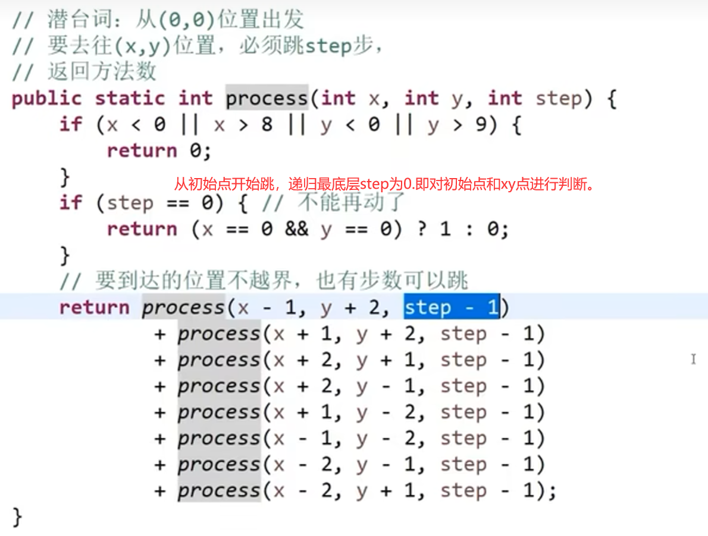

##### 改动态规划

因为是后一步依赖前一步，所以先准备第一步的数据，逐步往前，直到最后一步。

```java
JAVApublic static int ways2(int x, int y, int k) { 
  int[][][] dp = new int[10][9][k+1];// O~k
  dp[0][0][0] = 1;  // dp[..][..][0] = 0
  for(int level = 1; level <= k; level++) { 
    for(int x =0;x<10;x++){//x可能性
      for(int y =0; y < 9;y++){ 
      	 // 求 dp[i][j][level];  递归函数怎么求的。这里也怎么求
      	 dp[i][j][level]=
   getValue(dp,x+2,y-1, level-1)
  +getValue(dp,x + 2, y+1, level-1)
  +getValue(dp,х+1,y+2,level-1)
  +getValue(dp,x-1,у+2,level-1)
  +getValue(dp,x- 2,y+1,level-1)
  +getValue(dp,x - 2, y-1, level-1)
  +getValue(dp,x-1,y-2,level-1)
  +getValue(dp,x + 1, у-2, level-1);
           ;
      }
    }
  }
  return dp[x][y][k];
}

public static int getValue(int[][][] dp, int x, int y, int k) { 
  if(x<0 ｜｜  x>9 ｜｜ y<0 ｜｜ y>8){ 
  return 0;
  }
return dp[x][y][k];
}
```

------

#### bob 活着

题目：**给定范围横向 N，纵向 M，从（i，j）开始走 K 步（只能上下左右走，且概率相同）没有超过给定范围那么就是活着，如果在过程中超过了范围则死了，返回活着的概率。**

> 在这个题里面，每一个点 bob 都可以走上下左右，然后可以走 k 步，那么总共的可能步数是 4k, 之后获得了总共的活着的次数，用那个次数 / 4k 等等等就可以获取答案了

**递归实现**

```java

public class Main {

    public static int N, M;

    public static String process(int n, int m, int i, int j, int k) {
        N = n;
        M = m;
        int live = process(i, j, k);// 活着的情况
        int all = (int) Math.pow(4, k);// 一共存在的情况
        int gcb = gcb(all, live);// 求最大公约数
        return live / gcb + " / " + all / gcb;
    }

    private static int gcb(int m, int n) {
        if (n == 0) return m;
        return gcb(n, m % n);
    }

    // 计算活着的情况数
    public static int process(int i, int j, int K) {
        if (i < 1 || i > N || j < 1 || j > M) return 0;
        if (K == 0) return 1;
        return process(i + 1, j, K - 1) +
                process(i - 1, j, K - 1) +
                process(i, j + 1, K - 1) +
                process(i, j - 1, K - 1);
    }
}
```

**严格表结构**

```java
JAVAclass U {
    public static long gcd(long m, long n) {
        return n == 0 ? m : gcd(n, m % n);
    }

    public static String bob2(int N, int M, int i, int j, int K) {
        int[][][] dp = new int[N + 2][M + 2][K + 1];
        for (int row = 1; row <= N; row++) {//初始化数据
            for (int col = 1; col <= M; col++) {
                dp[row][col][0] = 1;
            }
        }
        for (int rest = 1; rest <= K; rest++) {
            for (int row = 1; row <= N; row++) {
                for (int col = 1; col <= M; col++) {
                	//递归依赖
                    dp[row][col][rest] = dp[row - 1][col][rest - 1];
                    dp[row][col][rest] += dp[row + 1][col][rest - 1];
                    dp[row][col][rest] += dp[row][col - 1][rest - 1];
                    dp[row][col][rest] += dp[row][col + 1][rest - 1];
                }
            }
        }
        long all = (long) Math.pow(4, K);
        long live = dp[i + 1][j + 1][K];
        long gcd = gcd(all, live);
        return (live / gcd) + "/" + (all / gcd);
    }
}
```

------

#### 拿钞票问题递归到动态规划

[16.基础提升 暴力递归（上）等_哔哩哔哩_bilibili](https://www.bilibili.com/video/BV13g41157hK?p=18&vd_source=90e0c824beb8147e32dde80f19bba722) 1:27:30

一个数组，里面的元素代表钞票面额，每种钞票都可以**无穷次**的拿，数组中无重复值、均为正数

给一个目标值，求用数组中有多少种办法将目标值凑出来？

> - 有重复的，我们使用从左到右模型，可变参数用的是当前要处理的元素的 index 和 rest (一般都差不多)
>
> - 注意每个元素可重复，所以我们直接把递归放到 for 循环里面，让他循环合理的次数就行，然后在每次循环都是普通的该怎么调用怎么调用，注意！！！
>
>   **for 循环开始和结束值**只要设置好，那么只要在里面简单的递归调用下一个位置的元素就就行了，比如说下面这个例子里面
>
>   - 一开始是 0, 所以相当于是调用给下一个元素而且不包括当前元素 (这个直接多给你弄好了，就不需要你弄两个递归什么的了，意思都一样，for 循环嘛！)
>   - 然后是 1 (这个列子里面) 代表当前下标的元素用了一次，然后调用下一个下标的元素
>   - 然后是 2 (这个列子里面) 代表当前下标的元素用了两次，然后调用下一个下标的元素
>   - …
>   - 然后是 N (这个列子里面，当然这个 N 的数量应该按照另外一个可变参数等等等获取到一个合理的数量，这里就是 `zhang * arr[index] <= rest` 很合理，zhang 数 (for 循环最终值) 就应该是这样决定的) 代表当前下标的元素用了 N 次，然后调用下一个下标的元素
>
> - 注意！
>
>   ```java
>   JAVAif(index == arr.length) {
>   	return rest ==0?1 :0 ; 
>   }
>   ```
>
>   这一块，我们还需要在里面测一下 rest 是不是等于 0 了，这是为了考虑数组最后一个元素，因为在数组最后一个元素的 index 的那一次递归的时候，他接着调用，就会调用 index+1, 此时他调用的递归的 index 就会是 arr.length, 我们需要在这里也要考虑 rest 是不是剩余 0 了，也就是考虑了数组最后一个值
>
> ==_*从左到右或者类似的都需要考虑这个_最后一个元素*，以及各种可能会出界等等等的问题！！！__==
>
> - 这里还介绍了如果递归函数里面有枚举行为，该怎么用 dp 优化，我们可以把那个枚举的循环直接放到我们那个 dp 表结构的多重循环里面，不过这样稍微时间复杂度有点高
>
> **不过我们可以再次优化，仔细观查每一个格子的依赖，看看有没有依赖于其他的格子，这个例子里面就发现一个列子如果同一行有数据了，我们可以更方便获取到那个格子的 value, 我们可以再次优化让他省掉那个循环，让 dp 表结构方法边的更快**
>
> == 注意只要之后在填表的时候，如果有枚举行为，就观察方式看看邻近的位置能不能替代枚举行为，只跟观察有关，** 跟原题没关！！！**==
>
> - 注意 dp 方式，一定一定一定要
>   - 保证可变参数越少越好 (dp 数组维度也可以减少)
>   - 保证可变参数最好只是一个整数什么的 (别整一个数组或者链表等等等，太多可能性了，dp 表很难表示)

**暴力递归**

```java
JAVA// arr中都是正数且无重复值，返回组成aim的方法数
public static int ways(int[] arr, int aim) {
        if(arr==nu1l||arr.length=0||aim<0){
            return 0;
        }
    return process(arr, 0, aim);
}
    //可以自由使用arr[index... ]所有的面值，每一种面值都可以使用任意张，
    //组成rest，有多少种方法
    public static int process(int[] arr, int index, int rest) {
        if(index == arr.length) {
        	return rest ==0?1 :0 ; 
        }
        int ways = 0;
        for(int zhang = 0;zhang * arr[index] <= rest ;zhang++) {
            ways += process(arr, index + 1, rest - (zhang * arr[index]) );
        }
    return ways;
}
```

有重复过程，所以有必要优化


**记忆 dp**

```java
JAVApublic static int ways2(int[] arr, int aim) {
    if (arr == nu1l || arr .1ength == 0|1 aim < 0) {
        return 0;
    }
        int[][] dp = new int[arr .1ength+1][aim+1];
        //一开始所有的过程，都没有计算呢
        // dp[..][..]
        = -1
        for(int i = 0 ; i < dp.1ength; i++) {
     	   for(int j = 0 ; j < dp[8].1ength; j++) {
        		dp[i][j] = -1;
           }
        }
        return process2(arr, 0，aim，dp);
}

//如果index和rest的参数组合，是没算过的，dp[index][rest]:== -1
//如果index和rest的参数组合，是算过的，dp[index][rest]> -1

public static int process(int[] arr, int index, int rest,int [][]dp) {
        if(dp[index][rest] != -1) {
        	return dp[index][rest];
        }

        if(index == arr.1ength) {
            dp[index][rest]=rest ==0?1 :0 ;
        	//return rest ==0?1 :0 ;
            return dp[index][rest];
        }
    
        int ways = 0;
        for(int zhang = 0;zhang * arr[index] <= rest ;zhang++) {
        	ways += process(arr, index + 1, rest - (zhang * arr[index]),dp );
        }
    // 进行缓存
    dp[index][rest]=ways;
    return ways;
}
```

**动态规划**

由下到上进行计算，每一行从左往右

```java
JAVApublic static int ways2(int[] arr, int aim) {
    if (arr == nu1l || arr .1ength == 0|| aim < 0) {
        return 0;
    }
    int N=arr.length;
    int[][] dp = new int[N+1][aim+1];
        //一开始所有的过程，都没有计算呢
        // dp[..][..]= -1
    //if(index == arr.1ength) {
      //	return rest ==0?1 :0 ;
    //}
    dp[N][0]=1;//dp[N][1...aim]=0;
 
    for(int index = N - 1; index >= 0; index--) {
        for(int rest = 0; rest <= aim; rest++) {
        	//dp[index][rest] = ?;
            
            int ways = 0;
            for(int zhang = 0;zhang * arr[index] <= rest ;zhang++) {
            	ways += dp[index + 1][rest - (zhang * arr[index])];
            }        
            dp[index][rest] = ways;

        }
    }

    return dp[0][aim];
}
```

> 这种时间复杂度是 O (N*aim2) 的

因为有枚举行为，可以进行优化

**比如，f（3，100） 其实是依赖 f（3，97）的**

–> f (3,100) 和 f (3,97) 都在一行上，都是面值代表是 3, 然后我们的 f (3,100) 其实就是下一行 (多少多少面值) 的 a 值 + b 值 + c 值等等等，但是我们已经算出 f (3,97) 的话我们知道 f (3,97) 的值是 b 值 + c 值等等等算出来的，所以我们只需要 a 值 + f (3,97) 的值就可以获取到 f (3,100) 的值，压根不需要重新让一个一个加到头了

> tip: 到了 dp 之后就不需要想原本的逻辑，就按照我们那种改法都改成 dp 表结构之后，然后再从依赖关系出发看看还能有什么优化等等等


> **所以可以更进一步优化**:

```java
JAVApublic static int ways2(int[] arr, int aim) {
    if (arr == nu1l || arr .1ength == 0|1 aim < 0) {
        return 0;
    }
    int N=arr.length;
    int[][] dp = new int[N+1][aim+1];
        //一开始所有的过程，都没有计算呢
        // dp[..][..]= -1
    //if(index == arr.1ength) {
      //	return rest ==0?1 :0 ;
    //}
    dp[N][0]=1;//dp[N][1...aim]=0;
 
    for(int index = N - 1; index >= 0; index--) {
        for(int rest = 0; rest <= aim; rest++) {
        	//dp[index][rest] = ?;
            dp[index][rest] = dp[index+1][rest];
            if(rest-arr[index]>=0){
                dp[index][rest]+=dp[index][rest-]
            }

        }
    }

    return dp[0][aim];
}
```


